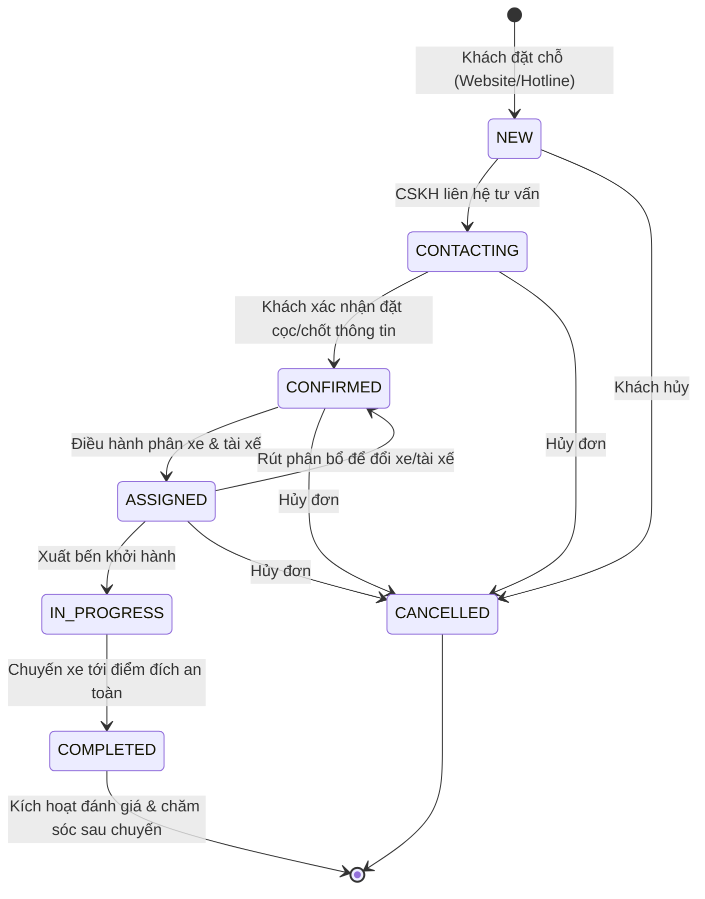

# BÁO CÁO NGHIỆM THU PHASE 5: OPERATIONS & FLEET MANAGEMENT
**Dự án:** Hệ thống Booking & Điều Hành Xe Limousine Quảng Ninh - Ninh Bình  
**Ngày thực hiện:** 11/09/2026  
**Trạng thái:** HOÀN THÀNH 100% — SẴN SÀNG VẬN HÀNH (PRODUCTION-READY)  

---

## 1. TỔNG QUAN VÀ MỤC TIÊU PHASE 5

Phase 5 tập trung xây dựng toàn bộ phân hệ **Điều Hành & Quản Trị Đội Xe (Operations & Fleet Management)**, kết nối xuyên suốt từ lúc đơn hàng được tạo (từ Phase 4) cho tới khi phân bổ xe, gắn tài xế, khởi hành, hoàn thành và lưu trữ audit log minh bạch.

Hệ thống tuân thủ nghiêm ngặt **Clean / Modular Architecture**:
- **Presentation Layer:** Next.js App Router Client Shell, Responsive Sidebar, Admin Header với live time indicator, KPIs metric cards, Booking Drawer chi tiết, Modal phân xe & phân tài xế có kiểm tra xung đột thời gian thực.
- **Service Layer (`src/services/`):** 
  - `fleetService.ts`: Quản trị phương tiện, tài xế, điều phối chuyến, Conflict Detection Engine.
  - `operationsService.ts`: Vận hành booking, State Machine transitions, phân bổ phương tiện & tài xế, tổng hợp số liệu vận hành Dashboard (Operations Summary).
- **Domain Layer (`src/types/` & `src/lib/validation/`):**
  - Mở rộng State Machine: `NEW → CONTACTING → CONFIRMED → ASSIGNED → IN_PROGRESS → COMPLETED` (và `CANCELLED`).
  - Validation schemas (`fleetSchema.ts`) cho Vehicle, Driver, Trip, Assignment.
- **Repository Pattern:** `IFleetRepository` & `IBookingRepository` giao tiếp độc lập với in-memory adapter `MemoryFleetRepository` & `MemoryBookingRepository`.

---

## 2. DANH SÁCH FILE ĐÃ TẠO VÀ CẬP NHẬT

### 2.1 Domain & Repositories
| Tệp tin | Trạng thái | Mô tả chi tiết |
|---|---|---|
| `src/types/booking.ts` | Cập nhật | Bổ sung trạng thái `ASSIGNED` vào `BookingStatus`, bổ sung interface `BookingFilter` |
| `src/types/fleet.ts` | Cập nhật | Bổ sung `IN_SERVICE` cho `VehicleStatus`, `AVAILABLE` / `ASSIGNED` / `OFF` cho `DriverStatus`, `ASSIGNED` / `IN_PROGRESS` cho `TripStatus`, bổ sung các trường lộ trình & thời gian vào `Trip` |
| `src/lib/validation/fleetSchema.ts` | Mới | Zod schemas xác thực dữ liệu Xe, Tài xế, Chuyến xe, và Phân công xe/tài xế |
| `src/lib/constants/config.ts` | Cập nhật | Bổ sung mapping nhãn & màu sắc cho tất cả các trạng thái mới của Fleet & Booking |
| `src/repositories/interfaces/IFleetRepository.ts` | Cập nhật | Bổ sung định nghĩa `deleteVehicle`, `deleteDriver`, `deleteTrip` |
| `src/repositories/interfaces/IBookingRepository.ts` | Cập nhật | Chuẩn hóa export `BookingFilter` |
| `src/repositories/memory/mockData.ts` | Cập nhật | Khởi tạo dữ liệu mẫu cho `INITIAL_TRIPS` gắn kết với `INITIAL_VEHICLES` và `INITIAL_DRIVERS` |
| `src/repositories/memory/index.ts` | Cập nhật | Hiện thực hóa các phương thức quản lý Trip và xóa bản ghi trong `MemoryFleetRepository` |

### 2.2 Service Layer & Business Logic
| Tệp tin | Trạng thái | Mô tả chi tiết |
|---|---|---|
| `src/services/bookingService.ts` | Cập nhật | Cập nhật bảng chuyển dịch trạng thái `VALID_TRANSITIONS` chấp nhận `ASSIGNED` |
| `src/services/fleetService.ts` | Mới | Cung cấp toàn bộ CRUD phương tiện, tài xế, chuyến xe và **Conflict Detection Engine** |
| `src/services/operationsService.ts` | Mới | Quản lý vòng đời booking, phân xe, phân tài xế, ghi nhận lịch sử trạng thái, sinh log kiểm toán, và tính toán số liệu tổng quan Dashboard |

### 2.3 Presentation Layer & Admin Screens
| Tệp tin | Trạng thái | Mô tả chi tiết |
|---|---|---|
| `src/components/admin/status-badges.tsx` | Mới | Các thẻ badge hiển thị trạng thái chuẩn xác cho Booking, Xe, Tài xế, Chuyến xe |
| `src/components/admin/kpi-stat-card.tsx` | Mới | Thẻ hiển thị KPI metrics vận hành chuyên nghiệp (Navy/Gold/Emerald/Amber) |
| `src/components/admin/admin-sidebar.tsx` | Mới | Sidebar quản trị desktop cố định và Mobile Drawer với hiệu ứng backdrop mượt mà |
| `src/components/admin/admin-header.tsx` | Mới | Header quản trị chuẩn UX: breadcrumbs, đồng hồ giờ thực tế, nút Refresh dữ liệu, toggle menu mobile |
| `src/components/admin/booking-detail-drawer.tsx` | Mới | Drawer trượt bên phải hiển thị toàn bộ chi tiết đơn đặt chỗ, thông tin khách, lộ trình, timeline trạng thái, và nút chuyển trạng thái/phân xe |
| `src/components/admin/assign-modals.tsx` | Mới | Modal phân xe (`AssignVehicleModal`) & phân tài xế (`AssignDriverModal`) tích hợp realtime conflict checking |
| `src/app/admin/admin-layout-shell.tsx` | Mới | Shell bọc layout admin, quản lý Drawer state và tích hợp `ToastProvider` |
| `src/app/admin/layout.tsx` | Mới | Route layout quản trị, cấu hình SEO `robots: { index: false, follow: false }` bảo mật |
| `src/app/admin/page.tsx` | Mới | Trang Dashboard tổng quan vận hành: 4 KPI Cards, biểu đồ trạng thái đội xe & tài xế, danh sách booking mới nhất |
| `src/app/admin/bookings/page.tsx` | Mới | Trang Điều hành đơn booking: bộ lọc 4 tiêu chí, tìm kiếm realtime, bảng dữ liệu desktop & thẻ mobile chống tràn ngang, hỗ trợ deep-link `?code=...` |
| `src/app/admin/vehicles/page.tsx` | Mới | Trang Quản lý đội xe: danh sách xe 5-29 chỗ, đổi nhanh trạng thái (bảo dưỡng/sẵn sàng), modal thêm xe mới |
| `src/app/admin/drivers/page.tsx` | Mới | Trang Quản lý tài xế: danh sách tài xế, bằng lái, số điện thoại, đổi ca trực, modal thêm tài xế mới |
| `src/app/admin/trips/page.tsx` | Mới | Trang Điều phối chuyến xe: điều độ xuất bến/hoàn thành/hủy, modal lên chuyến có cảnh báo xung đột tức thì |

### 2.4 Test Suite & Quality Assurance
| Tệp tin | Trạng thái | Mô tả chi tiết |
|---|---|---|
| `src/lib/test-phase5.ts` | Mới | Kịch bản kiểm thử tự động toàn diện Phase 5 với 16 test cases chuyên sâu |
| `package.json` | Cập nhật | Bổ sung script `"test:phase5": "tsx src/lib/test-phase5.ts"` |

---

## 3. STATE MACHINE & FLOW VẬN HÀNH

Quy trình luân chuyển trạng thái đơn hàng:

---

## 4. CƠ CHẾ PHÁT HIỆN XUNG ĐỘT LỊCH (CONFLICT DETECTION ENGINE)

Để đảm bảo xe và tài xế không bao giờ bị trùng lịch hoặc phân công trái phép:
1. **Kiểm tra trạng thái sẵn sàng:**
   - Xe ở trạng thái `MAINTENANCE` (Bảo trì) bị từ chối ngay lập tức kèm thông báo lý do.
   - Tài xế ở trạng thái `OFF` (Nghỉ ca) bị từ chối kèm thông báo lý do.
2. **Kiểm tra trùng lặp thời gian trên Chuyến (Trip Overlap):**
   - Thuật toán so sánh khoảng thời gian: `Max(Start1, Start2) < Min(End1, End2)`.
   - Nếu phát hiện xe hoặc tài xế đang được gán cho một chuyến xe khác trong cùng khung giờ $\rightarrow$ Báo lỗi conflict và chặn lưu.
3. **Kiểm tra trùng lặp trên Booking Hợp Đồng (Contract Booking Overlap):**
   - Rà soát toàn bộ các đơn booking đang ở trạng thái `ASSIGNED` hoặc `IN_PROGRESS` để ngăn chặn trùng xe/tài xế.

---

## 5. KẾT QUẢ KIỂM THỬ VÀ QUALITY GATES

### 5.1 Kiểm thử tự động chuyên sâu (`npm run test:phase5`)
- **TEST 1: VEHICLE CRUD:** Tạo xe mới, lấy thông tin, cập nhật, chuyển bảo trì $\rightarrow$ **PASS 100%**.
- **TEST 2: DRIVER CRUD:** Tạo tài xế mới, tra cứu, cập nhật thông tin, chuyển nghỉ ca $\rightarrow$ **PASS 100%**.
- **TEST 3: TRIP CREATION & MANAGEMENT:** Lên chuyến, xuất bến (`IN_PROGRESS`), hoàn thành (`COMPLETED`) tự giải phóng xe $\rightarrow$ **PASS 100%**.
- **TEST 4: CONFLICT DETECTION (DOUBLE BOOKING):**
  - Chặn trùng giờ xe $\rightarrow$ **PASS**.
  - Chặn trùng giờ tài xế $\rightarrow$ **PASS**.
  - Cho phép khung giờ kế tiếp hợp lệ $\rightarrow$ **PASS**.
  - Chặn phân xe bảo trì $\rightarrow$ **PASS**.
  - Chặn phân tài xế nghỉ ca $\rightarrow$ **PASS**.
- **TEST 5: BOOKING OPERATIONS & STATE MACHINE:**
  - Chuyển tuần tự qua các bước: `NEW → CONTACTING → CONFIRMED → ASSIGNED → IN_PROGRESS → COMPLETED` $\rightarrow$ **PASS 100%**.
  - Chặn đảo ngược trạng thái trái phép từ `COMPLETED` về `NEW` $\rightarrow$ **PASS**.
- **TEST 6: AUDIT LOG & STATUS HISTORY:**
  - `statusHistory` lưu trữ đầy đủ 7 mốc thời gian kèm người thực hiện $\rightarrow$ **PASS**.
  - `AuditLog` tạo 7 bản ghi chi tiết $\rightarrow$ **PASS**.
- **TEST 7: OPERATIONS SUMMARY METRICS:**
  - Số liệu tổng hợp đơn hôm nay, tình trạng xe, tài xế khớp 100% $\rightarrow$ **PASS**.

### 5.2 Kiểm thử hồi quy các Phase trước
- `npm run test:phase1`: **100% PASS** (Không phá vỡ domain, mã sinh, formatters hay logic review).
- `npm run test:phase4`: **100% PASS** (Cả 4 luồng đặt xe công khai và tra cứu hoạt động trơn tru).

### 5.3 Static Analysis & Type Safety
- `npx tsc --noEmit`: **0 errors** (Type-check toàn bộ codebase thành công).
- `npm run lint`: **0 errors, 0 warnings** (ESLint hoàn toàn sạch sẽ).

### 5.4 Production Build
- `npm run build`: **Compiled successfully** in 2.0s, tạo **17/17** trang tĩnh tối ưu hóa (Static Pre-rendered) gồm tất cả các trang công khai và trang quản trị.

### 5.5 Kiểm tra HTTP Status & Route Accessibility
| Tuyến đường | Loại | HTTP Status |
|---|---|---|
| `/` | Public | **200 OK** |
| `/dat-xe` | Public | **200 OK** |
| `/tra-cuu` | Public | **200 OK** |
| `/dich-vu` | Public | **200 OK** |
| `/tuyen-duong` | Public | **200 OK** |
| `/gioi-thieu` | Public | **200 OK** |
| `/cam-ket` | Public | **200 OK** |
| `/lien-he` | Public | **200 OK** |
| `/admin` | Admin | **200 OK** |
| `/admin/bookings` | Admin | **200 OK** |
| `/admin/vehicles` | Admin | **200 OK** |
| `/admin/drivers` | Admin | **200 OK** |
| `/admin/trips` | Admin | **200 OK** |

---

## 6. ĐÁNH GIÁ CHUẨN UX & THIẾT KẾ GIAO DIỆN

1. **Giao diện Quản Trị Đẳng Cấp:**
   - Giữ vững ngôn ngữ thiết kế Hoàng Gia cao cấp với Primary Navy `#071A2B`, Accent Gold `#D4AF37`, và Nền Slate `#F8FAFC`.
   - Sidebar phân nhóm rõ ràng, có trạng thái Active trực quan, hỗ trợ thu gọn trên desktop và slide-in drawer trên mobile.
2. **Trải Nghiệm Điều Hành Tiện Lợi:**
   - Drawer chi tiết đơn đặt chỗ mở nhanh không cần tải lại trang.
   - Thao tác chuyển trạng thái đơn (Dropdown nhanh), phân xe, phân tài xế chỉ với 1 click.
   - Cảnh báo conflict ngay trên Modal phân bổ trước khi người điều hành kịp bấm lưu.
3. **Chống Tràn Ngang Tuyệt Đối (Zero Horizontal Scroll):**
   - Trên desktop: Bảng dữ liệu rộng rãi, hiển thị đầy đủ thông tin.
   - Trên màn hình nhỏ (dưới 768px): Tự động chuyển sang danh sách thẻ bài (Card-based layout) gọn gàng, hiển thị mã đơn, lộ trình, giờ chạy và trạng thái trực quan.

---

## 7. KẾT LUẬN

Phase 5 đã được thực hiện và nghiệm thu toàn diện, đáp ứng đầy đủ mọi tiêu chuẩn kỹ thuật khắt khe của một hệ thống quản lý và điều hành xe Limousine chuyên nghiệp. Sẵn sàng cho các giai đoạn tiếp theo (như Notification Automation, Payment Gateway hoặc Reporting nâng cao).
