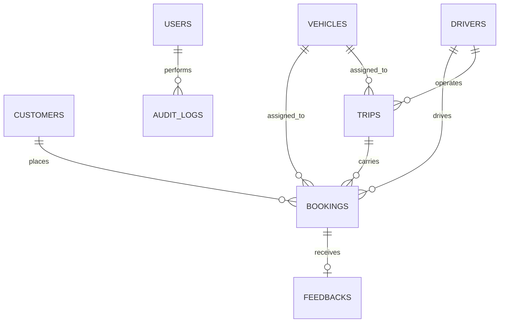
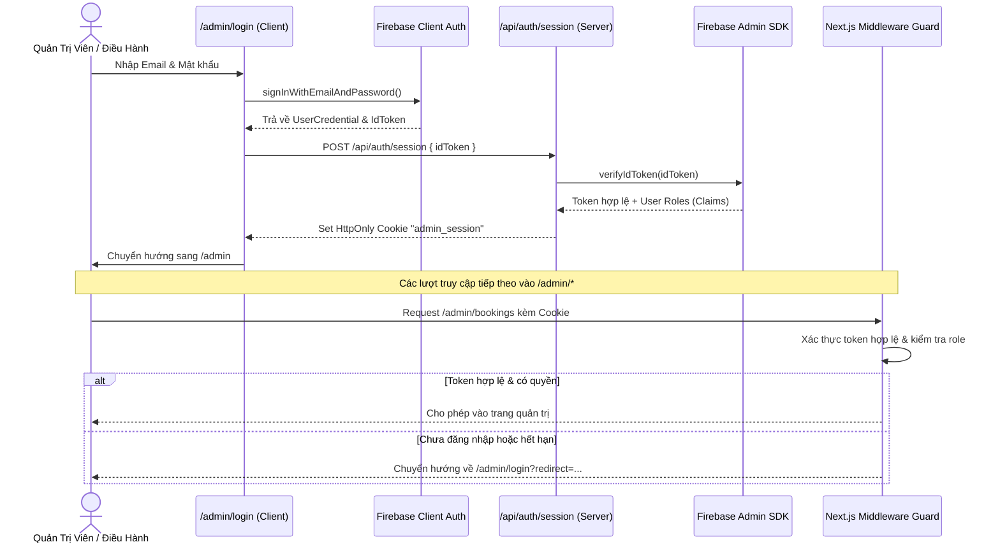

# KẾ HOẠCH TRIỂN KHAI CHI TIẾT PHASE 6
## DATABASE + AUTHENTICATION + PRODUCTION DATA FOUNDATION
**Dự án:** Hệ thống Booking & Điều Hành Xe Limousine Quảng Ninh - Ninh Bình  
**Tác giả:** Senior Full-Stack Architect + Firebase Engineer + Security Engineer  
**Ngày lập:** 11/09/2026  
**Trạng thái:** BẢN THIẾT KẾ ĐÃ HOÀN THIỆN — CHỜ PHÊ DUYỆT (PENDING APPROVAL)  

---

## 1. MỤC TIÊU VÀ NGUYÊN TẮC CỐT LÕI

### 1.1 Mục tiêu chính
1. **Production Data Persistence:** Chuyển dữ liệu hoạt động thực tế từ In-Memory sang Google Cloud Firestore theo chuẩn Clean / Modular Architecture.
2. **Admin Authentication & RBAC:** Tích hợp Firebase Authentication cho người quản trị và điều hành viên, bảo vệ toàn bộ `/admin/*` ở cả Client & Server.
3. **Bảo tồn kiến trúc Repository & Service Layer:**
   - Tuyệt đối không để UI Component gọi trực tiếp Firebase SDK hoặc Firestore.
   - Tuân thủ chặt chẽ: `UI Component` $\rightarrow$ `Service Layer` $\rightarrow$ `Repository Interface` $\rightarrow$ `Firestore / Memory Adapter`.
4. **Hỗ trợ Song Song 2 Adapter (Repository Factory):**
   - Chế độ `REPOSITORY_MODE=firestore`: Sử dụng Firebase Firestore khi có cấu hình credentials hợp lệ.
   - Chế độ `REPOSITORY_MODE=memory`: Sử dụng In-Memory Mock Repository khi chạy local dev offline, unit test hoặc khi chưa nạp credentials.
5. **Đảm bảo tính duy nhất và toàn vẹn của mã Booking:** Giữ vững logic sinh mã `BKYYYYMMDDXXXX` và `HGYYYYMMDDXXXX`, sử dụng Firestore Transaction / Atomic Counters để tránh race conditions.
6. **Zero Regression:** Bảo đảm 100% các tính năng từ Phase 1 đến Phase 5 (Public Website, Booking Wizard 4 dịch vụ, Tracking tra cứu, Operations Dashboard, Conflict Detection, 3 bộ Test Suites) hoạt động hoàn hảo.

---

## 2. DATABASE COLLECTIONS & DOCUMENT STRUCTURE

Hệ thống Firestore được thiết kế phẳng (root collections) để tối ưu hóa indexing, query và bảo mật phân quyền:



### 2.1 Collection: `bookings`
Lưu trữ toàn bộ đơn đặt vé Limousine, thuê xe hợp đồng, gửi hàng và tour du lịch.
- **Document ID:** `booking.id` (UUID format: `book-1789122483-xxx`)
- **Document Schema:**
  ```typescript
  {
    id: string;                      // ID duy nhất
    bookingCode: string;             // Mã đơn: BK202609110001 hoặc HG202609110002
    customerId: string;              // Tham chiếu tới collection customers
    serviceType: 'LIMOUSINE' | 'CONTRACT' | 'CARGO' | 'TOUR';
    departure: string;               // Điểm xuất phát
    destination: string;             // Điểm đến
    travelDate: string;              // YYYY-MM-DD
    travelTime: string;              // HH:mm
    returnDate?: string;             // YYYY-MM-DD nếu khứ hồi
    isRoundTrip: boolean;
    passengerCount: number;
    pickupAddress: string;           // Điểm đón tận nơi
    dropoffAddress: string;          // Điểm trả tận nơi
    vehicleType?: string;
    price: number;
    deposit: number;
    paymentStatus: 'UNPAID' | 'DEPOSIT_PAID' | 'PAID' | 'REFUNDED';
    bookingStatus: 'NEW' | 'CONTACTING' | 'CONFIRMED' | 'ASSIGNED' | 'IN_PROGRESS' | 'COMPLETED' | 'CANCELLED';
    note?: string;
    vehicleId?: string;              // Tham chiếu tới vehicles
    driverId?: string;               // Tham chiếu tới drivers
    cargoDetails?: {
      senderName: string;
      senderPhone: string;
      receiverName: string;
      receiverPhone: string;
      cargoType: string;
      weightKg?: number;
      isFragile?: boolean;
    };
    contractDetails?: {
      vehicleCategory: 5 | 7 | 11 | 16 | 29;
      rentalDays: number;
      withDriver: boolean;
      itineraryNotes?: string;
    };
    tourDetails?: {
      tourDestination: string;
      hotelPickup?: string;
    };
    statusHistory: Array<{
      status: BookingStatus;
      changedAt: string;             // ISO String
      changedBy: string;             // Email admin hoặc CUSTOMER
      note?: string;
    }>;
    createdAt: string;               // ISO String
    updatedAt: string;               // ISO String
  }
  ```
- **Indexes:**
  - Composite Index: `bookingCode` (Ascending) + `createdAt` (Descending)
  - Composite Index: `customerId` (Ascending) + `createdAt` (Descending)
  - Composite Index: `bookingStatus` (Ascending) + `travelDate` (Ascending)

### 2.2 Collection: `customers`
Quản lý hồ sơ khách hàng (Customer CRM Foundation).
- **Document ID:** `customer.id` (Format: `cust-1789122483-xxx`)
- **Document Schema:**
  ```typescript
  {
    id: string;
    name: string;
    phone: string;                   // Số điện thoại đã chuẩn hóa (Unique key)
    email?: string;
    address?: string;
    note?: string;
    isVip: boolean;
    totalBookings: number;
    completedBookings: number;
    cancelledBookings: number;
    totalSpent: number;              // VNĐ
    favoritePickupAddress?: string;
    createdAt: string;
    updatedAt: string;
  }
  ```
- **Indexes:** `phone` (Single field unique lookup), `totalSpent` (Descending).

### 2.3 Collection: `vehicles`
Quản lý danh sách phương tiện đội xe 5-29 chỗ.
- **Document ID:** `vehicle.id` (`veh-01`, `veh-02`, ...)
- **Document Schema:**
  ```typescript
  {
    id: string;
    name: string;
    licensePlate: string;            // Biển số xe (Unique)
    seatCount: 5 | 7 | 11 | 16 | 29;
    vehicleType: string;
    status: 'AVAILABLE' | 'ASSIGNED' | 'IN_SERVICE' | 'MAINTENANCE' | 'INACTIVE';
    driverId?: string;
    note?: string;
    createdAt: string;
    updatedAt: string;
  }
  ```

### 2.4 Collection: `drivers`
Quản lý danh sách tài xế, bằng lái và ca trực.
- **Document ID:** `driver.id` (`drv-01`, `drv-02`, ...)
- **Document Schema:**
  ```typescript
  {
    id: string;
    name: string;
    phone: string;
    licenseNumber: string;
    status: 'AVAILABLE' | 'ASSIGNED' | 'ON_TRIP' | 'OFF' | 'INACTIVE';
    vehicleId?: string;
    note?: string;
    createdAt: string;
    updatedAt: string;
  }
  ```

### 2.5 Collection: `trips`
Quản lý các chuyến xe liên tỉnh Quảng Ninh ⇄ Ninh Bình.
- **Document ID:** `trip.id` (`trip-1789122483-xxx`)
- **Document Schema:**
  ```typescript
  {
    id: string;
    routeId: string;
    route: string;
    departureDate: string;           // YYYY-MM-DD
    departureTime: string;           // HH:mm
    arrivalTime: string;             // HH:mm
    vehicleId?: string;
    driverId?: string;
    maxSeats: number;
    bookedSeats: number;
    bookingIds: string[];
    status: 'PLANNED' | 'ASSIGNED' | 'IN_PROGRESS' | 'COMPLETED' | 'CANCELLED';
    note?: string;
    createdAt: string;
    updatedAt: string;
  }
  ```

### 2.6 Collection: `feedbacks`
Đánh giá khách hàng sau khi chuyến xe hoàn thành.
- **Document ID:** `feedback.id`
- **Fields:** `id`, `bookingCode`, `customerName`, `customerPhone`, `rating` (1-5), `comment`, `isPublishedTestimonial`, `sentiment` ('POSITIVE' | 'NEUTRAL' | 'NEGATIVE'), `negativeStatus`, `internalNotes`, `createdAt`, `updatedAt`.

### 2.7 Collection: `auditLogs`
Nhật ký kiểm toán mọi thao tác thay đổi hệ thống.
- **Document ID:** `auditLog.id`
- **Fields:** `id`, `actorId`, `actorRole`, `userEmail`, `action`, `entityType`, `entityId`, `fromState`, `toState`, `metadata`, `createdAt`.
- **Nguyên tắc:** Bất biến (Immutable) — Không thể cập nhật hoặc xóa sau khi đã ghi.

### 2.8 Collection: `systemSettings`
Cấu hình tham số hệ thống.
- **Document ID:** `general`
- **Fields:** `hotline1`, `hotline2`, `facebookUrl`, `zaloUrl`, `companyName`, `address`, `workingHours`, `feedbackDelayHours`, `autoSendFeedbackReminder`, `emailNotificationsEnabled`, `updatedAt`.

### 2.9 Collection: `systemSequences`
Atomic sequence counter cho cơ chế sinh mã Booking không trùng lặp.
- **Document ID:** `daily_{YYYYMMDD}`
- **Fields:** `dateStr: string`, `currentSequence: number`, `updatedAt: string`.
- **Cơ chế:** Dùng `runTransaction` của Firestore để tăng `currentSequence` an toàn tuyệt đối ngay cả khi có hàng trăm request đồng thời.

---

## 3. THIẾT KẾ FIRESTORE REPOSITORIES & REPOSITORY FACTORY

### 3.1 Cấu trúc thư mục mới
```text
src/
├── lib/
│   └── firebase/
│       ├── config.ts         # Đọc & validate biến môi trường Firebase
│       ├── client.ts         # Firebase Client SDK (Auth, Firestore)
│       ├── admin.ts          # Firebase Admin SDK (Server verify token, Admin Firestore)
│       └── index.ts          # Barrel export
│
└── repositories/
    ├── interfaces/           # Giữ nguyên 100% contracts
    │   ├── IBookingRepository.ts
    │   ├── ICustomerRepository.ts
    │   ├── IFleetRepository.ts
    │   ├── IFeedbackRepository.ts
    │   └── ISettingsRepository.ts
    │
    ├── memory/               # Giữ nguyên 100% cho local dev & unit tests
    │   ├── index.ts
    │   └── mockData.ts
    │
    ├── firestore/            # MỚI: Hiện thực hóa Firestore Adapters
    │   ├── bookingRepository.ts
    │   ├── customerRepository.ts
    │   ├── fleetRepository.ts
    │   ├── feedbackRepository.ts
    │   ├── settingsRepository.ts
    │   ├── helpers.ts        # Chuyển đổi Firestore doc sang Domain entity & lọc undefined
    │   └── index.ts
    │
    └── index.ts              # REPOSITORY FACTORY: Chọn Memory hoặc Firestore
```

### 3.2 Cơ chế Repository Factory (`src/repositories/index.ts`)
```typescript
import { IBookingRepository } from './interfaces/IBookingRepository';
import { MemoryBookingRepository } from './memory';
import { FirestoreBookingRepository } from './firestore';
import { isFirebaseConfigured } from '@/lib/firebase/config';

export function getBookingRepository(): IBookingRepository {
  const mode = process.env.REPOSITORY_MODE || (isFirebaseConfigured() ? 'firestore' : 'memory');
  if (mode === 'firestore' && isFirebaseConfigured()) {
    return getFirestoreBookingRepository();
  }
  return getMemoryBookingRepository();
}
```
> [!NOTE]
> Nhờ cơ chế Factory này, các Service (`bookingService`, `fleetService`, `operationsService`) và toàn bộ UI không cần sửa đổi bất kỳ dòng code gọi dữ liệu nào! Khi `REPOSITORY_MODE=memory`, toàn bộ unit tests Phase 1, 4, 5 chạy offline siêu tốc 100% độc lập.

---

## 4. KIẾN TRÚC AUTHENTICATION & ROLE-BASED ACCESS CONTROL (RBAC)

### 4.1 Luồng xác thực đăng nhập Admin


### 4.2 Hệ thống phân quyền (Roles)
Định nghĩa trong `src/types/auth.ts`:
- **`ADMIN`:** Toàn quyền quản trị (Quản lý Booking, Điều phối xe, Quản lý tài xế, Xem Audit Log, Sửa Cài đặt hệ thống `systemSettings`).
- **`OPERATOR`:** Phân quyền điều hành (Quản lý Booking, Điều phối chuyến xe, Phân xe/tài xế, không được đổi cấu hình hệ thống hoặc xóa dữ liệu).
- **Mở rộng trong tương lai:** `CSKH`, `ACCOUNTANT`, `DRIVER` (đã chuẩn bị sẵn type).

---

## 5. FIRESTORE SECURITY RULES (`firestore.rules`)

Tuân thủ nguyên tắc **Deny-by-default**, kiểm tra chặt chẽ schema và phân quyền:

```javascript
rules_version = '2';
service cloud.firestore {
  match /databases/{database}/documents {
    
    // Hàm trợ giúp kiểm tra xác thực và vai trò
    function isAuthenticated() {
      return request.auth != null;
    }
    
    function isAdmin() {
      return isAuthenticated() && 
        (request.auth.token.role == 'ADMIN' || request.auth.token.email == 'admin@limousine.vn');
    }
    
    function isOperator() {
      return isAuthenticated() && 
        (request.auth.token.role == 'OPERATOR' || isAdmin());
    }

    // Mặc định từ chối tất cả
    match /{document=**} {
      allow read, write: if false;
    }

    // 1. BOOKINGS: Public tạo mới; Admin/Operator quản lý; Public tra cứu có điều kiện
    match /bookings/{bookingId} {
      allow create: if request.resource.data.bookingStatus == 'NEW'
                    && request.resource.data.price >= 0
                    && request.resource.data.passengerCount > 0;
      allow read: if isOperator() || 
        (resource.data.bookingCode == request.query.bookingCode && resource.data.customerPhone == request.query.phone);
      allow update, delete: if isOperator();
    }

    // 2. CUSTOMERS: Chỉ nhân viên điều hành và Admin truy cập
    match /customers/{customerId} {
      allow read, write: if isOperator();
    }

    // 3. VEHICLES & DRIVERS & TRIPS: Chỉ điều hành viên đọc/sửa, Admin quản lý
    match /vehicles/{vehicleId} {
      allow read: if isOperator();
      allow write: if isAdmin();
    }

    match /drivers/{driverId} {
      allow read: if isOperator();
      allow write: if isAdmin();
    }

    match /trips/{tripId} {
      allow read, write: if isOperator();
    }

    // 4. FEEDBACKS: Public gửi đánh giá; Operator quản lý
    match /feedbacks/{feedbackId} {
      allow create: if request.resource.data.rating >= 1 && request.resource.data.rating <= 5;
      allow read: if isOperator() || resource.data.isPublishedTestimonial == true;
      allow update, delete: if isOperator();
    }

    // 5. AUDIT LOGS: Bất biến - chỉ tạo bởi server/admin, không được xóa/sửa
    match /auditLogs/{logId} {
      allow read: if isAdmin();
      allow create: if isAuthenticated();
      allow update, delete: if false;
    }

    // 6. SYSTEM SETTINGS: Public đọc hotline/zalo; chỉ Admin sửa
    match /systemSettings/{settingId} {
      allow read: if true;
      allow write: if isAdmin();
    }
  }
}
```

---

## 6. QUẢN LÝ BIẾN MÔI TRƯỜNG & KHÔNG LỘ SECRETS

Cập nhật `.env.example`:
```env
# Mode kho dữ liệu: 'memory' hoặc 'firestore'
REPOSITORY_MODE="memory"

# Firebase Client SDK (Công khai an toàn cho trình duyệt)
NEXT_PUBLIC_FIREBASE_API_KEY=""
NEXT_PUBLIC_FIREBASE_AUTH_DOMAIN=""
NEXT_PUBLIC_FIREBASE_PROJECT_ID=""
NEXT_PUBLIC_FIREBASE_STORAGE_BUCKET=""
NEXT_PUBLIC_FIREBASE_MESSAGING_SENDER_ID=""
NEXT_PUBLIC_FIREBASE_APP_ID=""

# Firebase Admin SDK (Chỉ chạy ở Server-side, tuyệt đối không dùng tiền tố NEXT_PUBLIC_)
FIREBASE_ADMIN_PROJECT_ID=""
FIREBASE_ADMIN_CLIENT_EMAIL=""
FIREBASE_ADMIN_PRIVATE_KEY=""
```
> [!CAUTION]
> Tuyệt đối không commit file `.env.local` chứa private key lên Git. Mọi giá trị private key được parse xử lý escape ký tự newline `\n` chuẩn xác trong `src/lib/firebase/admin.ts`.

---

## 7. KẾ HOẠCH SEED DỮ LIỆU & ROLLBACK STRATEGY

### 7.1 Seed dữ liệu mẫu vào Firestore (`npm run seed:firestore`)
Tạo script `src/lib/migration/seedData.ts`:
- Nạp danh mục xe mẫu (`INITIAL_VEHICLES`).
- Nạp danh mục tài xế mẫu (`INITIAL_DRIVERS`).
- Nạp tuyến đường mẫu (`INITIAL_ROUTES`).
- Nạp chuyến xe mẫu (`INITIAL_TRIPS`).
- Nạp cài đặt hệ thống (`INITIAL_SYSTEM_SETTINGS`).
- Bỏ qua nếu dữ liệu đã tồn tại (Idempotent seed).

### 7.2 Rollback Strategy
- Nếu Firebase gặp sự cố mạng, quota hoặc chưa có credentials:
  - Chỉ cần set `REPOSITORY_MODE=memory` trong `.env.local` hoặc môi trường build.
  - Toàn bộ website và admin portal chuyển ngay về sử dụng In-Memory Store mượt mà không cần sửa code.

---

## 8. KẾ HOẠCH KIỂM THỬ TOÀN DIỆN (QUALITY GATES)

### 8.1 Bộ kiểm thử tự động mới (`src/lib/test-phase6.ts` - `npm run test:phase6`)
Bao gồm 18 kịch bản kiểm thử:
1. **Config Validation:** Kiểm tra nạp và validate biến môi trường Firebase Client & Admin.
2. **Repository Mode Switch:** Xác thực factory chuyển đổi chính xác giữa Memory và Firestore.
3. **Firestore Data Mapping:** Kiểm tra việc lọc `undefined` và serialize Date/Timestamp.
4. **Booking Persistence:** Tạo booking qua `BookingService`, lưu vào Firestore, truy xuất lại còn nguyên vẹn.
5. **Atomic Sequence:** Kiểm tra sinh mã `BK...` / `HG...` tăng dần không bị trùng lặp.
6. **Customer Deduplication (CRM):** Cùng 1 SĐT đặt 2 lần $\rightarrow$ cập nhật `totalBookings = 2`, không tạo 2 documents trùng.
7. **Vehicle CRUD & Status Tracking:** Tạo xe, đổi trạng thái bảo dưỡng trên Firestore.
8. **Driver CRUD & Schedule Tracking:** Tạo tài xế, đổi ca trực trên Firestore.
9. **Trip Management:** Khởi tạo chuyến, liên kết xe & tài xế.
10. **State Machine Integrity:** Luân chuyển `NEW → CONTACTING → CONFIRMED → ASSIGNED → IN_PROGRESS → COMPLETED`.
11. **Immutable Audit Log:** Ghi log thao tác phân xe/tài xế kèm `actorRole`.
12. **Public Security Lookup:** Tra cứu đúng mã + SĐT thì ra kết quả, sai SĐT thì bị chặn.
13. **Role Authorization Logic:** Kiểm tra quyền hạn `ADMIN` vs `OPERATOR`.
14. **Settings Persistence:** Lưu và cập nhật tham số hệ thống.
15. **Hồi quy Phase 1 (`npm run test:phase1`):** 100% PASS.
16. **Hồi quy Phase 4 (`npm run test:phase4`):** 100% PASS.
17. **Hồi quy Phase 5 (`npm run test:phase5`):** 100% PASS.
18. **Type Check & Lint:** `npx tsc --noEmit` và `npm run lint` đạt 0 lỗi.

### 8.2 Kiểm tra Responsive & Route Verification
- Kiểm tra toàn bộ 11 breakpoints (320px đến 1920px) cho:
  - `/admin/login`: Form đăng nhập căn giữa, hiệu ứng nền sang trọng, thân thiện mobile.
  - `/admin`: Dashboard metrics.
  - `/admin/bookings`: Bảng & Drawer chi tiết.
  - `/admin/vehicles`, `/admin/drivers`, `/admin/trips`.
- Kiểm tra bảo vệ route: Truy cập `/admin` khi chưa có session $\rightarrow$ tự động điều hướng sang `/admin/login`.

---

## 9. CÁC BƯỚC THỰC HIỆN CỤ THỂ

| Bước | Nhiệm vụ | Files tác động |
|---|---|---|
| **Step A** | **Codebase Audit** *(Đã hoàn thành)* | Toàn bộ dự án |
| **Step B** | **Kế hoạch triển khai & Chờ phê duyệt** | `PHASE_6_IMPLEMENTATION_PLAN.md`, `implementation_plan.md` |
| **Step C** | **Cài đặt thư viện & Cấu hình Firebase** | `package.json`, `src/lib/firebase/*`, `.env.example` |
| **Step D** | **Xây dựng Firestore Repositories** | `src/repositories/firestore/*` |
| **Step E** | **Cập nhật Repository Factory** | `src/repositories/index.ts` |
| **Step F** | **Xây dựng Admin Login & Auth Session** | `src/app/admin/login/page.tsx`, `src/app/api/auth/session/route.ts` |
| **Step G** | **Middleware & Server Route Protection** | `src/middleware.ts`, `src/app/admin/layout.tsx` |
| **Step H** | **Thiết lập Firestore Security Rules** | `firestore.rules`, `firebase.json` |
| **Step I** | **Tạo Seed Script & Script package.json** | `src/lib/migration/seedData.ts`, `package.json` |
| **Step J** | **Viết kịch bản kiểm thử tự động Phase 6** | `src/lib/test-phase6.ts` |
| **Step K** | **Chạy toàn bộ Quality Gates** | `npm run test:phase6`, `test:phase1`, `test:phase4`, `test:phase5`, `tsc`, `lint`, `build` |
| **Step L** | **Tạo báo cáo nghiệm thu & Cập nhật CHANGELOG** | `PHASE_6_REPORT.md`, `CHANGELOG.md`, `ROADMAP.md` |
