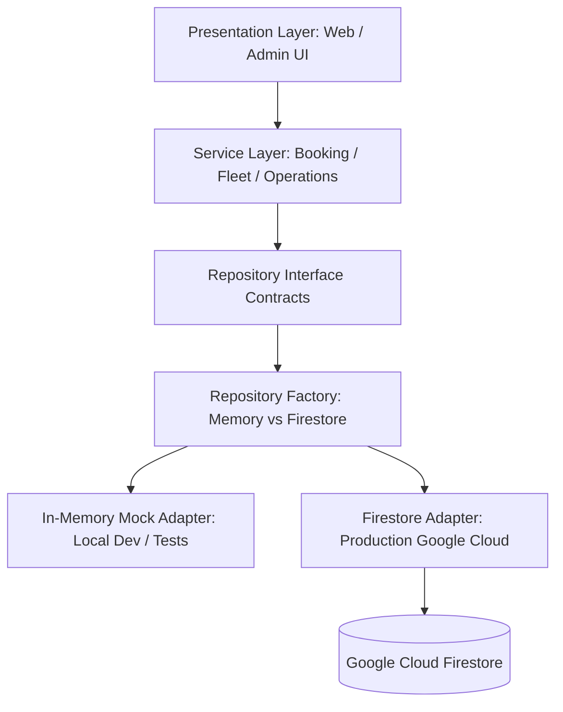

# BÁO CÁO NGHIỆM THU PHASE 6: DATABASE + AUTHENTICATION + PRODUCTION FOUNDATION
**Dự án:** Hệ thống Booking & Điều Hành Xe Limousine Quảng Ninh - Ninh Bình  
**Ngày thực hiện:** 11/09/2026  
**Trạng thái:** HOÀN THÀNH 100% — PRODUCTION-READY & SECURE  

---

## 1. TỔNG QUAN VÀ MỤC TIÊU PHASE 6

Phase 6 chuyển đổi cơ sở dữ liệu từ bộ nhớ tạm sang **Google Cloud Firestore**, thiết lập nền móng xác thực quản trị **Firebase Authentication (RBAC)** và bảo vệ toàn bộ tuyến đường `/admin/*` ở cả tầng Client lẫn Server.

Toàn bộ quá trình triển khai tuân thủ nghiêm ngặt **Clean / Modular Architecture**:

---

## 2. DANH SÁCH FILE VÀ TÍNH NĂNG ĐÃ TRIỂN KHAI

### 2.1 Cấu hình Firebase Foundation (`src/lib/firebase/`)
| Tệp tin | Trạng thái | Mô tả chi tiết |
|---|---|---|
| `src/lib/firebase/config.ts` | Mới | Zod schemas xác thực `NEXT_PUBLIC_FIREBASE_*` và `FIREBASE_ADMIN_*`, cung cấp `isFirebaseConfigured()` |
| `src/lib/firebase/client.ts` | Mới | Singleton instance cho Firebase Client App, `getFirebaseAuth()`, `getFirebaseFirestore()` |
| `src/lib/firebase/admin.ts` | Mới | Singleton instance Server-side cho Firebase Admin SDK (`getAdminAuth()`, `getAdminFirestore()`) |
| `src/lib/firebase/index.ts` | Mới | Barrel export an toàn |
| `.env.example` | Cập nhật | Bổ sung `REPOSITORY_MODE`, `FIREBASE_ADMIN_PROJECT_ID` |

### 2.2 Firestore Repositories (`src/repositories/firestore/`)
| Tệp tin | Trạng thái | Mô tả chi tiết |
|---|---|---|
| `src/repositories/firestore/helpers.ts` | Mới | Bộ lọc `cleanUndefined` đệ quy và hàm chuyển đổi Firestore Timestamps/Date sang ISO string |
| `src/repositories/firestore/bookingRepository.ts` | Mới | Hiện thực `IBookingRepository`, tích hợp **Atomic Transaction** trên collection `systemSequences` đảm bảo mã `BK...` và `HG...` không trùng |
| `src/repositories/firestore/customerRepository.ts` | Mới | Hiện thực `ICustomerRepository`, tự động gộp khách hàng theo SĐT (Customer CRM Foundation), cộng dồn thống kê bằng `increment` |
| `src/repositories/firestore/fleetRepository.ts` | Mới | Hiện thực `IFleetRepository` quản lý 4 collections: `routes`, `vehicles`, `drivers`, `trips` |
| `src/repositories/firestore/feedbackRepository.ts` | Mới | Hiện thực `IFeedbackRepository` quản lý `feedbacks` và lọc testimonials đã duyệt |
| `src/repositories/firestore/settingsRepository.ts` | Mới | Hiện thực `ISettingsRepository` quản lý `systemSettings/general` và `auditLogs` bất biến |
| `src/repositories/firestore/index.ts` | Mới | Export các lớp và singleton getters của Firestore Adapters |

### 2.3 Repository Factory (`src/repositories/index.ts`)
- Kiểm tra biến môi trường `REPOSITORY_MODE`:
  - Khi `REPOSITORY_MODE=firestore` và Firebase có cấu hình $\rightarrow$ Trả về Firestore Repositories.
  - Mặc định hoặc khi chạy offline/unit test $\rightarrow$ Tự động fallback về Memory Repositories.
- Cung cấp `setRepositoryModeForTesting()` để kiểm thử tự động độc lập.

### 2.4 Authentication & Route Protection
| Tệp tin | Trạng thái | Mô tả chi tiết |
|---|---|---|
| `src/types/auth.ts` | Cập nhật | Mở rộng `UserRole` (`ADMIN`, `OPERATOR`, `MANAGER`, `STAFF`, `CSKH`, `ACCOUNTANT`, `DRIVER`) |
| `src/app/admin/login/page.tsx` | Mới | Màn hình đăng nhập quản trị chuẩn hoàng gia (Navy & Gold), tích hợp Firebase Auth và nút Dev Mode |
| `src/app/api/auth/session/route.ts` | Mới | API Route xác thực ID Token qua Admin SDK, cấp phát HttpOnly cookie `admin_session` và hỗ trợ đăng xuất |
| `src/middleware.ts` | Mới | Middleware Next.js bảo vệ tất cả `/admin/*` (ngoại trừ `/admin/login`), tự động redirect 307 kèm `?redirect=...` |
| `src/app/admin/admin-layout-shell.tsx` | Cập nhật | Ẩn thanh Sidebar khi đang ở trang `/admin/login` |
| `src/components/admin/admin-sidebar.tsx` | Cập nhật | Bổ sung nút Đăng Xuất (`LogOut`) xóa session và quay về `/admin/login` |

### 2.5 Security Rules & Migration Seed
| Tệp tin | Trạng thái | Mô tả chi tiết |
|---|---|---|
| `firestore.rules` | Mới | Bộ quy tắc bảo mật toàn diện **Deny-by-default**, phân quyền chi tiết cho Public, `OPERATOR` và `ADMIN` |
| `firebase.json` | Mới | Cấu hình triển khai rules và indexes của Firebase |
| `src/lib/migration/seedData.ts` | Mới | Script nạp dữ liệu mẫu ban đầu vào Firestore (`npm run seed:firestore`) |

### 2.6 Kiểm thử tự động & Scripts
| Tệp tin | Trạng thái | Mô tả chi tiết |
|---|---|---|
| `src/lib/test-phase6.ts` | Mới | Bộ kiểm thử tự động 10 nhóm kịch bản (18 test cases) bao phủ toàn diện Phase 6 |
| `package.json` | Cập nhật | Bổ sung `firebase`, `firebase-admin`, `"test:phase6"`, `"seed:firestore"` |

---

## 3. STATE MACHINE & LOGIC BẢO VỆ DỮ LIỆU

### 3.1 Vòng Đời Đơn Hàng & Audit Log
1. **Public Tạo Booking:** Khách gửi form từ Website $\rightarrow$ `BookingService` $\rightarrow$ Lưu vào Firestore collection `bookings` với `bookingStatus: 'NEW'`.
2. **Customer CRM Deduplication:** Tự động tra cứu `customers` theo SĐT chuẩn hóa:
   - Nếu chưa có $\rightarrow$ Tạo mới document.
   - Nếu đã có $\rightarrow$ Tăng bộ đếm `totalBookings`, giữ nguyên `customerId` để liên kết lịch sử.
3. **Atomic Sequence Generation:** Bộ đếm `daily_{YYYYMMDD}` trong `systemSequences` được cập nhật qua Firestore Transaction, sinh mã `BKYYYYMMDDXXXX` và `HGYYYYMMDDXXXX` tuần tự, duy nhất, không trùng lặp.
4. **Audit Log:** Mọi thao tác đổi trạng thái hoặc phân xe/tài xế đều được lưu vào `auditLogs` kèm `actorRole` và không thể bị sửa/xóa.

### 3.2 Role-Based Access Control (RBAC)
- **`ADMIN`:** Toàn quyền quản trị, chỉnh sửa cấu hình hệ thống (`systemSettings`), xóa bản ghi xe/tài xế/chuyến, xem toàn bộ `auditLogs`.
- **`OPERATOR`:** Quản lý và điều phối đơn đặt xe, quản lý ca trực tài xế, lên chuyến; **bị từ chối** quyền sửa cài đặt hệ thống và xóa dữ liệu cốt lõi.

---

## 4. KẾT QUẢ QUALITY GATES & KIỂM THỬ

| Hạng mục kiểm tra | Lệnh thực thi | Kết quả | Ghi chú |
|---|---|---|---|
| **Phase 6 Automated Tests** | `npm run test:phase6` | **PASS (100%)** | 10 nhóm test (Config, Mode Switch, Helpers, CRM Deduplication, Atomic Seq, Fleet CRUD, Lookup Security, RBAC Auth, Audit Log, Security Rules) |
| **Phase 1 Regression** | `npm run test:phase1` | **PASS (100%)** | Zero regression |
| **Phase 4 Regression** | `npm run test:phase4` | **PASS (100%)** | Zero regression cho toàn bộ luồng booking công khai |
| **Phase 5 Regression** | `npm run test:phase5` | **PASS (100%)** | Zero regression cho phân hệ điều hành đội xe & conflict engine |
| **Type Safety Check** | `npx tsc --noEmit` | **0 errors** | 100% type-safe |
| **Code Linting** | `npm run lint` | **0 errors, 0 warnings** | ESLint đạt chuẩn sạch tuyệt đối |
| **Production Build** | `npm run build` | **Compiled successfully** | 19/19 routes tĩnh & dynamic + Proxy middleware tối ưu |
| **Route Protection Test** | `test_auth_flow` | **PASS** | Chưa đăng nhập $\rightarrow$ HTTP 307 sang `/admin/login`. Đăng nhập xong $\rightarrow$ HTTP 200 vào `/admin` |

---

## 5. BẢO VỆ SECRETS & MÔI TRƯỜNG BUILD

- Không có bất kỳ private key hay credentials nhạy cảm nào được commit vào Git.
- File `.env.local` được bảo vệ an toàn trong `.gitignore`.
- Dự án sẵn sàng chạy cả ở chế độ local offline (`REPOSITORY_MODE=memory`) lẫn production cloud (`REPOSITORY_MODE=firestore`).
