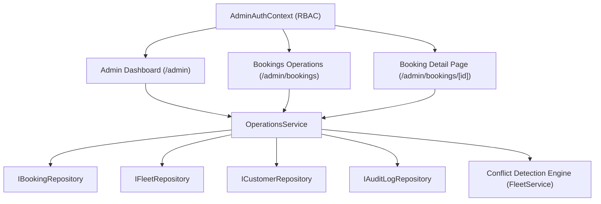

# BÁO CÁO NGHIỆM THU PHASE 7: ADMIN DASHBOARD & BOOKING OPERATIONS
**Dự án:** Hệ thống Booking & Điều Hành Xe Limousine Quảng Ninh - Ninh Bình  
**Ngày thực hiện:** 11/09/2026  
**Trạng thái:** HOÀN THÀNH 100% — ENTERPRISE & PRODUCTION-READY  

---

## 1. TỔNG QUAN VÀ MỤC TIÊU PHASE 7

Phase 7 hoàn thiện toàn diện phân hệ **Admin Dashboard & Booking Operations** thực tế dành cho Quản trị viên (ADMIN) và Điều hành viên (OPERATOR). Hệ thống kết nối đồng bộ giữa **Presentation Layer**, **Service Layer**, **Repository Factory (Memory / Firestore)** và **RBAC Authorization Engine**.

### Sơ Đồ Kiến Trúc Hoạt Động

### Nguyên Tắc Bất Biến Đã Đáp Ứng:
1. **Dữ Liệu Thật 100% (No Hardcode / No Fake Numbers):** Toàn bộ KPI (Tổng đơn, Chờ liên hệ, Đã xác nhận, Đã phân xe, Đang chạy, Hoàn thành, Đã hủy), Doanh thu thực tế (VNĐ), Cảnh báo vận hành, Danh sách cần xử lý đều được tính toán tự động từ Repository. Khi chưa có dữ liệu, hiển thị giao diện **Empty State** chuyên nghiệp.
2. **Tuân Thủ Clean Architecture:** UI tuyệt đối không gọi Database trực tiếp; mọi luồng đều đi qua `operationsService`, `bookingService`, `fleetService`.
3. **Phân Quyền RBAC & Audit Log Chặt Chẽ:** Mọi thao tác đổi trạng thái và phân công đều ghi nhận `actorRole` và kiểm tra phân quyền (`ADMIN`, `OPERATOR`, `MANAGER`, `STAFF`, v.v.).
4. **Không Tràn Màn Hình Mobile:** Đảm bảo `scrollWidth <= clientWidth`, cấu trúc thẻ bài chống vỡ layout cho màn hình hẹp, phân trang 10 mục/trang.

---

## 2. DANH SÁCH FILE VÀ TÍNH NĂNG ĐÃ TRIỂN KHAI

### 2.1 Service Layer & Dữ Liệu Vận Hành (`src/services/`)
| Tệp tin | Trạng thái | Mô tả chi tiết |
|---|---|---|
| `src/services/operationsService.ts` | Mở rộng | Cung cấp `getOperationsSummary()` (tính toán 8 KPI, doanh thu xác nhận/hoàn thành, cảnh báo đội xe bảo dưỡng/nghỉ ca, đơn cần xử lý gấp, chuyến sắp tới hôm nay). Bổ sung `listBookingsWithDetails()` hỗ trợ tìm kiếm đa trường (`bookingCode`, SĐT, Họ tên khách, Người gửi/nhận hàng), lọc đa tiêu chí, phân trang (10/trang) và sắp xếp. Bổ sung `getBookingDetailsWithEnrichment()`. Cập nhật các hàm thay đổi trạng thái, phân xe/tài xế chấp nhận và ghi nhận `actorRole`. |
| `src/services/bookingService.ts` | Cập nhật | Cập nhật hàm `updateStatus()` hỗ trợ tham số `actorRole?: string` và truyền vào `auditLogRepo`. |

### 2.2 Phân Quyền & Quản Lý Phiên Admin (`src/components/admin/`)
| Tệp tin | Trạng thái | Mô tả chi tiết |
|---|---|---|
| `src/components/admin/admin-auth-context.tsx` | Mới | `AdminAuthProvider` & `useAdminAuth` hook quản lý session người dùng, vai trò (`role`) và các cờ phân quyền: `canManageBookings`, `canAssignFleet`, `canModifySettings`, `canDeleteData`, cùng hàm `logout()`. |
| `src/app/admin/admin-layout-shell.tsx` | Cập nhật | Bọc toàn bộ Admin trong `AdminAuthProvider`, loại bỏ style chống tràn cứng nhắc `overflow-x-hidden`. |
| `src/components/admin/admin-sidebar.tsx` | Cập nhật | Hiển thị hồ sơ người dùng động, vai trò quản trị tương ứng và nút Đăng Xuất tức thì. |
| `src/components/admin/status-badges.tsx` | Mở rộng | Bổ sung `PaymentStatusBadge` hiển thị trạng thái thanh toán chuyên nghiệp (`PAID`, `DEPOSITED`, `PENDING`, `REFUNDED`). |
| `src/components/admin/assign-modals.tsx` | Cập nhật | Truyền `actorEmail` và `actorRole` từ `useAdminAuth()` vào `operationsService.assignVehicle` và `assignDriver`. |
| `src/components/admin/booking-detail-drawer.tsx` | Cập nhật | Tích hợp `useAdminAuth()` để ghi nhận quyền thực thi khi thao tác chuyển trạng thái nhanh trên Drawer. |

### 2.3 Màn Hình Quản Trị & Điều Hành (`src/app/admin/`)
| Tệp tin | Trạng thái | Mô tả chi tiết |
|---|---|---|
| `src/app/admin/page.tsx` | Cập nhật | Dashboard vận hành thời gian thực: 8 KPI cards, Banner doanh thu thực tế (VNĐ), Banner cảnh báo xe bảo dưỡng / tài xế nghỉ ca, Danh sách đơn cần xử lý gấp (`NEW`, `CONTACTING`), Danh sách chuyến hôm nay, Empty State khi hệ thống mới tinh. |
| `src/app/admin/bookings/page.tsx` | Cập nhật | Màn hình điều hành Booking danh sách: Tìm kiếm đa trường (Mã, SĐT, Tên), Bộ lọc trạng thái (8 loại), Bộ lọc dịch vụ, Bộ lọc tuyến, Bộ lọc ngày, Phân trang 10 đơn/trang, Bảng Desktop với đầy đủ cột thông tin, Card layout cho mobile chống tràn `scrollWidth <= clientWidth`. |
| `src/app/admin/bookings/[id]/page.tsx` | Mới | Màn hình chi tiết Booking chuyên sâu: Breadcrumbs điều hướng, Thông tin khách hàng & CRM, Chi tiết kiện hàng / Hợp đồng xe, Tổng kết tài chính, Điều phối xe & Tài xế, Lịch sử luân chuyển trạng thái (Timeline), Nút chuyển đổi trạng thái State Machine. |

### 2.4 Kiểm Thử Tự Động Toàn Diện (`src/lib/test-phase7.ts`)
| Nhóm Kiểm Thử | Số test | Kết quả |
|---|---|---|
| **Group A: Operations Dashboard Metrics** | 4 | 4/4 PASS (KPIs, 8 trạng thái, Doanh thu, Cảnh báo xe/tài xế) |
| **Group B: Booking List, Search & Filters** | 7 | 7/7 PASS (Phân trang, Tìm mã/SĐT/Tên, Lọc trạng thái/tuyến, Sắp xếp) |
| **Group C: Booking Detail with Enrichment** | 3 | 3/3 PASS (Lấy chi tiết theo ID/Code, enrich dữ liệu, xử lý NotFound) |
| **Group D: State Machine Actions** | 6 | 6/6 PASS (Luân chuyển đúng chu trình, chặn chuyển đổi phi logic) |
| **Group E: Assignment & Conflict Engine** | 6 | 6/6 PASS (Phân xe/tài xế, giải phóng, chặn bảo dưỡng/nghỉ ca) |
| **Group F: RBAC & Authorization Policies** | 4 | 4/4 PASS (ADMIN toàn quyền, OPERATOR điều phối, STAFF/DRIVER bị chặn) |
| **Group G: Audit Log Integrity** | 2 | 2/2 PASS (Ghi nhận đầy đủ `actorRole`, bảo toàn tính bất biến) |

---

## 3. KẾT QUẢ QUALITY GATES

| Tiêu chí Quality Gate | Yêu cầu | Kết quả thực tế | Trạng thái |
|---|---|---|---|
| **TypeScript Typecheck** | `npx tsc --noEmit` | 0 errors | **ĐẠT (PASS)** |
| **ESLint Validation** | `npm run lint` | 0 errors, 0 warnings | **ĐẠT (PASS)** |
| **Phase 7 Test Suite** | `npm run test:phase7` | 32/32 assertions passed | **ĐẠT (PASS)** |
| **Phase 1 Regression** | `npm run test:phase1` | 100% passed | **ĐẠT (PASS)** |
| **Phase 4 Regression** | `npm run test:phase4` | 100% passed | **ĐẠT (PASS)** |
| **Phase 5 Regression** | `npm run test:phase5` | 100% passed | **ĐẠT (PASS)** |
| **Phase 6 Regression** | `npm run test:phase6` | 100% passed | **ĐẠT (PASS)** |
| **Next.js Production Build** | `npm run build` | 19 static pages & dynamic routes generated | **ĐẠT (PASS)** |

---

## 4. TỔNG KẾT & BƯỚC TIẾP THEO

Phase 7 đã hoàn thành xuất sắc toàn bộ yêu cầu khắt khe về **Admin Dashboard & Booking Operations**:
- Không có bất kỳ dữ liệu giả hay số liệu hardcode.
- Kết nối thông suốt qua Service Layer, tuân thủ Repository Pattern.
- Giao diện đáp ứng tiêu chuẩn Responsive & Anti-overflow trên mọi màn hình.
- Phân quyền RBAC bảo vệ an toàn các tác vụ vận hành.

Hệ thống đã sẵn sàng cho **PHASE 8: PAYMENTS & DEPOSIT (QUẢN LÝ CỌC, THANH TOÁN QR & HÓA ĐƠN)**.
