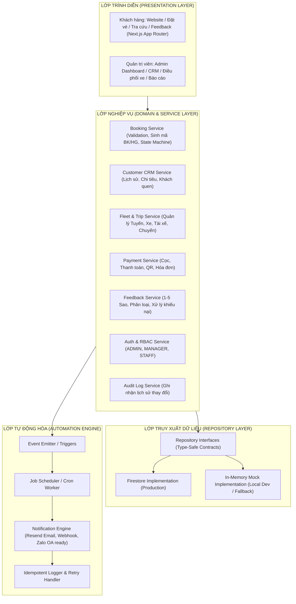
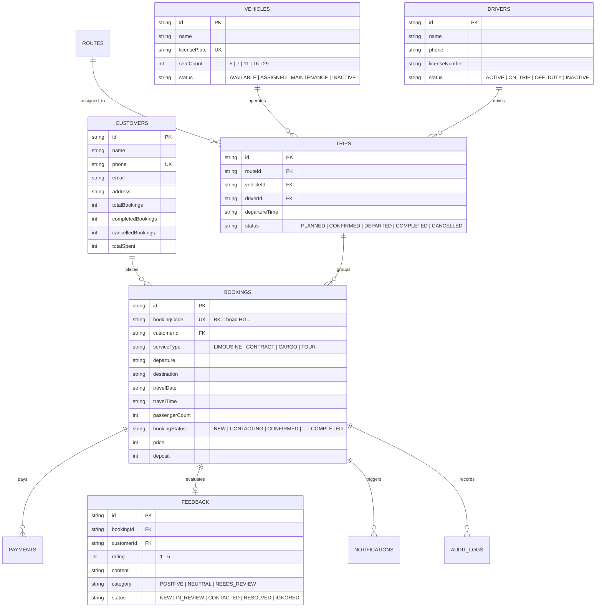
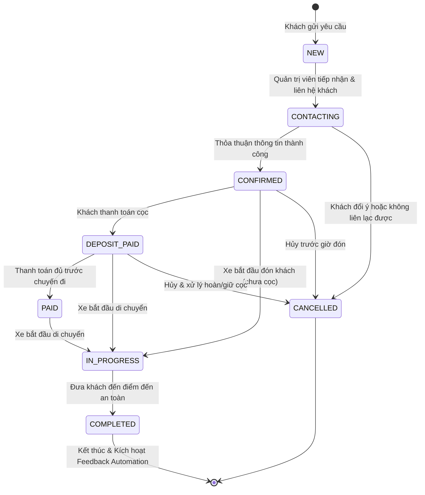
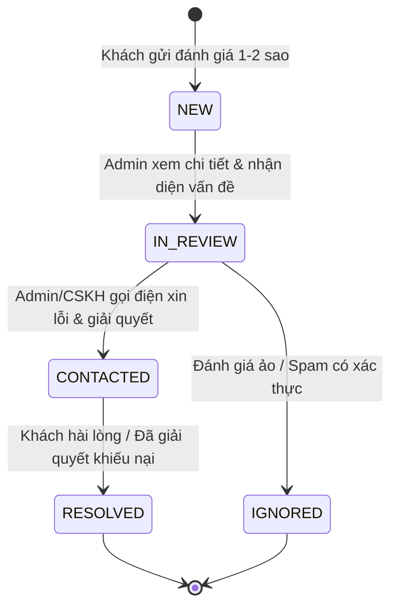

# KIẾN TRÚC HỆ THỐNG (SYSTEM ARCHITECTURE)
**Hệ thống Booking & Quản lý Dịch vụ Limousine Quảng Ninh - Ninh Bình**

- **Phiên bản:** 1.0.0
- **Trạng thái:** Thiết kế chuẩn bị triển khai (Architecture Blueprint)
- **Tác giả:** Senior Full-Stack & System Architect

---

## 1. TỔNG QUAN KIẾN TRÚC (HIGH-LEVEL OVERVIEW)

Hệ thống được thiết kế theo mô hình **Modular Clean Architecture** kết hợp với **Event-Driven Automation**, tách biệt rõ rệt giữa giao diện người dùng (Presentation), nghiệp vụ cốt lõi (Domain & Service Layer), và tầng truy xuất dữ liệu (Data Access / Repository Layer).



---

## 2. NGUYÊN TẮC THIẾT KẾ CỐT LÕI (CORE PRINCIPLES)

1. **Separation of Concerns (SoC) & Single Responsibility (SRP):**
   - UI Component chỉ đảm nhiệm việc render và nhận tương tác, không chứa logic nghiệp vụ hay truy vấn database trực tiếp.
   - Domain logic được đóng gói độc lập trong các Services.
2. **Repository Pattern:**
   - Cung cấp lớp trừu tượng hoá việc lưu trữ dữ liệu. Giao diện người dùng và service không bị phụ thuộc cứng vào Firestore SDK.
   - Hỗ trợ chạy local phát triển ngay cả khi chưa thiết lập Firebase API Key.
3. **Idempotency trong Automation:**
   - Bất kỳ background worker hay cron job nào chạy lại nhiều lần với cùng một điều kiện dữ liệu đều không được sinh ra hành động trùng lặp (ví dụ: không gửi 2 email xin feedback cho cùng một đơn hoàn thành).
4. **Defensive Programming & Type Safety:**
   - Mọi input từ người dùng đều được validate nghiêm ngặt thông qua Zod schema ở cả Client và Server.
   - 100% TypeScript, nghiêm cấm dùng `any`.
5. **Mobile-First & Visual Excellence:**
   - Thiết kế chuẩn từ màn hình nhỏ nhất (320px) đến màn hình desktop lớn (1920px).
   - Màu sắc chủ đạo: Navy (`#071A2B`), Gold (`#D4AF37`), White (`#FFFFFF`).

---

## 3. CẤU TRÚC THƯ MỤC CHUẨN (PROJECT DIRECTORY STRUCTURE)

```text
book_bus_tickets/
├── .env.example                     # Mẫu biến môi trường
├── .env.local                       # Biến môi trường local (được gitignore)
├── .gitignore                       # Danh sách file loại trừ khỏi Git
├── package.json                     # Quản lý dependencies & scripts
├── tsconfig.json                    # Cấu hình TypeScript nghiêm ngặt
├── tailwind.config.ts               # Cấu hình Design System tokens (Navy, Gold)
├── next.config.mjs                  # Cấu hình Next.js
│
├── docs/                            # Tài liệu kiến trúc & vận hành
│   ├── ARCHITECTURE.md              # Kiến trúc hệ thống
│   ├── DATABASE.md                  # Mô hình dữ liệu & Security Rules
│   ├── API.md                       # Đặc tả API contracts & Server Actions
│   ├── AUTOMATION.md                # Thiết kế luồng tự động hóa & Cron
│   ├── SECURITY.md                  # Hướng dẫn bảo mật & RBAC
│   ├── TESTING.md                   # Kế hoạch kiểm thử & Checklist
│   ├── DEPLOYMENT.md                # Hướng dẫn build & triển khai
│   └── CHANGELOG.md                 # Nhật ký thay đổi theo từng phase
│
├── public/                          # Tài nguyên tĩnh công khai
│   ├── icons/                       # Icons xe, dịch vụ, tiện ích
│   ├── images/                      # Ảnh xe limousine, banner chất lượng cao
│   └── favicon.ico                  # Favicon thương hiệu
│
└── src/
    ├── app/                         # Next.js App Router (Pages & Layouts)
    │   ├── layout.tsx               # Root layout (Font, Theme, Metadata)
    │   ├── page.tsx                 # Trang chủ Public
    │   ├── globals.css              # Style toàn cục & CSS variables
    │   │
    │   ├── dat-ve/                  # Trang đặt vé Limousine liên tỉnh
    │   │   └── page.tsx
    │   ├── thue-xe/                 # Trang đặt xe hợp đồng 5-29 chỗ
    │   │   └── page.tsx
    │   ├── gui-hang/                # Trang tạo đơn gửi hàng hóa
    │   │   └── page.tsx
    │   ├── du-lich/                 # Trang đặt xe tour du lịch
    │   │   └── page.tsx
    │   ├── tuyen-duong/             # Trang thông tin các tuyến phục vụ
    │   │   └── page.tsx
    │   ├── tra-cuu/                 # Trang tra cứu đơn theo mã + SĐT
    │   │   └── page.tsx
    │   ├── feedback/                # Trang gửi đánh giá
    │   │   └── [code]/page.tsx      # Form đánh giá chuyến đi theo mã booking
    │   │
    │   ├── admin/                   # Admin Portal (Protected Routes)
    │   │   ├── layout.tsx           # Layout Admin với Sidebar & Header
    │   │   ├── login/page.tsx       # Trang đăng nhập Admin
    │   │   ├── dashboard/page.tsx   # Tổng quan Dashboard chỉ số
    │   │   ├── bookings/page.tsx    # Quản lý Đơn đặt xe & Vận chuyển
    │   │   ├── customers/page.tsx   # Quản lý Khách hàng & CRM mini
    │   │   ├── routes/page.tsx      # Quản lý Tuyến xe
    │   │   ├── vehicles/page.tsx    # Quản lý Đội xe
    │   │   ├── drivers/page.tsx     # Quản lý Tài xế
    │   │   ├── trips/page.tsx       # Điều phối Chuyến xe
    │   │   ├── payments/page.tsx    # Quản lý Thanh toán & Cọc
    │   │   ├── feedback/page.tsx    # Xử lý Đánh giá & Phản hồi xấu
    │   │   ├── reports/page.tsx     # Báo cáo & Thống kê
    │   │   └── settings/page.tsx    # Cài đặt hệ thống
    │   │
    │   └── api/                     # API Handlers & Background Workers
    │       ├── bookings/route.ts    # Public API tạo booking
    │       ├── tracking/route.ts    # Public API tra cứu
    │       ├── feedback/route.ts    # Public API submit feedback
    │       └── cron/                # Scheduled Cron Endpoints
    │           ├── process-feedback/route.ts
    │           └── daily-summary/route.ts
    │
    ├── components/                  # UI Components
    │   ├── ui/                      # Reusable UI Atoms (Button, Input, Modal, Badge, Toast)
    │   ├── layout/                  # Header, Footer, AdminSidebar, FloatingActions
    │   ├── booking/                 # Các form booking (Vé, Hợp đồng, Hàng hóa, Tour)
    │   ├── tracking/                # Card tra cứu tiến trình chuyến đi
    │   ├── feedback/                # Widget 5 sao, Form đánh giá, Nút Google Review
    │   └── admin/                   # Bảng dữ liệu, Bộ lọc, Form điều phối xe, Thống kê
    │
    ├── lib/                         # Tiện ích cốt lõi & Cấu hình
    │   ├── firebase/                # Khởi tạo Firebase Client & Admin SDK
    │   ├── validation/              # Zod validation schemas cho mọi form
    │   ├── utils/                   # Format tiền tệ VNĐ, ngày giờ, số điện thoại
    │   └── constants/               # Hằng số: Danh sách tỉnh, loại xe, trạng thái
    │
    ├── types/                       # TypeScript Definitions & Interfaces
    │   ├── booking.ts               # Kiểu dữ liệu Booking & Vận đơn
    │   ├── customer.ts              # Kiểu dữ liệu Khách hàng
    │   ├── fleet.ts                 # Kiểu dữ liệu Xe, Tài xế, Tuyến, Chuyến
    │   ├── payment.ts               # Kiểu dữ liệu Thanh toán
    │   ├── feedback.ts              # Kiểu dữ liệu Đánh giá & Phản hồi
    │   └── auth.ts                  # Kiểu dữ liệu Phân quyền & Phiên làm việc
    │
    ├── services/                    # Business Domain Services
    │   ├── bookingService.ts
    │   ├── customerService.ts
    │   ├── fleetService.ts
    │   ├── paymentService.ts
    │   ├── feedbackService.ts
    │   ├── automationService.ts
    │   └── authService.ts
    │
    └── repositories/                # Data Access Repositories
        ├── interfaces/              # Định nghĩa Interface cho các Repository
        ├── firestore/               # Triển khai Firestore thực tế
        └── memory/                  # Triển khai In-Memory cho Test & Offline
```

---

## 4. MÔ HÌNH DỮ LIỆU & QUAN HỆ THỰC THỂ (DATA ENTITY RELATIONSHIPS)



---

## 5. MÁY TRẠNG THÁI NGHIỆP VỤ (STATE MACHINES)

### 5.1. Vòng Đời Trạng Thái Booking (Booking State Transitions)
Các trạng thái tuân thủ nghiêm ngặt quy tắc chuyển đổi một chiều hoặc theo nhánh nghiệp vụ cho phép:



### 5.2. Vòng Đời Xử Lý Phản Hồi Tiêu Cực (Negative Feedback Workflow)
Dành riêng cho các đánh giá 1-2 sao hoặc khiếu nại khách hàng:



---

## 6. KIẾN TRÚC TỰ ĐỘNG HÓA & NỀN TẢNG WORKER (AUTOMATION ENGINE)

Luồng hoạt động tự động tuân thủ nguyên tắc:
**EVENT → TRIGGER → VALIDATION → ACTION → RESULT → LOG → RETRY**

1. **Trigger:** Lắng nghe sự kiện `bookingStatus` chuyển sang `COMPLETED`.
2. **Scheduling:** Tính toán `feedbackAvailableAt = completedAt + settings.feedbackDelayHours` (mặc định trễ 2 giờ sau chuyến đi).
3. **Queue / Task Record:** Tạo bản ghi trong collection `notifications` với trạng thái `PENDING`.
4. **Worker / Cron:**
   - Định kỳ mỗi giờ quét các notification có `status = PENDING` và `feedbackAvailableAt <= NOW()`.
   - Cập nhật atomic lock trạng thái sang `PROCESSING`.
   - Thực thi gửi link đánh giá (Web SMS/Zalo/Email tùy kênh cấu hình).
   - Nếu thành công: Đổi sang `SENT`, ghi nhận `sentAt`.
   - Nếu thất bại: Đổi sang `FAILED`, ghi nhận `error`, tăng `retryCount`. Nếu `retryCount < 3`, đặt lại lịch thử lại sau 30 phút.
5. **Đảm bảo Idempotency:** Kiểm tra `feedbackId` hoặc `bookingId` đã tồn tại bản ghi yêu cầu đánh giá chưa trước khi tạo mới. Tuyệt đối không sinh 2 bản ghi gửi cho cùng một booking.

---

## 7. BẢO MẬT & PHÂN QUYỀN (SECURITY & RBAC)

### 7.1. Phân quyền vai trò (Role-Based Access Control)
- **ADMIN:** Toàn quyền hệ thống (Tài chính, cấu hình hệ thống, xóa mềm dữ liệu, quản lý tài khoản nhân viên, xem báo cáo toàn diện).
- **MANAGER:** Quản lý điều phối xe/tài xế, xử lý khiếu nại khách hàng, duyệt cọc, sửa chuyến, xem báo cáo vận hành.
- **STAFF:** Tiếp nhận booking mới, liên hệ khách, cập nhật trạng thái chuyến đi trong ca trực, không thể sửa cấu hình hay xem báo cáo tài chính cấp cao.

### 7.2. Bảo vệ dữ liệu nhạy cảm
- Số điện thoại khách hàng không được public ra ngoài.
- Trang tra cứu công khai bắt buộc người dùng nhập đúng cặp `(Mã Booking + Số điện thoại)`.
- Dữ liệu mật khẩu tài khoản Admin được bảo vệ bởi Firebase Authentication mã hóa hash an toàn.
- Form submit công khai được trang bị Honeypot field và Server-side Rate Limiting chống spam đơn ảo.

---

## 8. HỆ THỐNG GIAO DIỆN & RESPONSIVE (DESIGN SYSTEM & UX)

- **Color Tokens:**
  - Primary: `#071A2B` (Navy Hoàng gia - Biểu trưng cho sự vững chãi, cao cấp)
  - Accent / Gold: `#D4AF37` (Vàng kim sang trọng - Điểm nhấn nút CTA, badge VIP)
  - Background: `#F8FAFC` (Slate sáng dịu mắt)
  - Card / Surface: `#FFFFFF` (Trắng tinh tế với viền mỏng và đổ bóng thanh lịch)
  - Text Primary: `#0F172A`, Text Secondary: `#64748B`
- **Breakpoints chuẩn:**
  - `xs`: 320px - 389px (Small Mobile)
  - `sm`: 390px - 639px (Standard Mobile)
  - `md`: 640px - 767px (Large Mobile / Phablet)
  - `lg`: 768px - 1023px (Tablet Portrait)
  - `xl`: 1024px - 1279px (Tablet Landscape / Small Laptop)
  - `2xl`: 1280px - 1535px (Desktop 1366px - 1440px)
  - `3xl`: 1536px+ (Full HD / Ultra-wide 1920px)

---

## 9. KẾT LUẬN & SỰ SẴN SÀNG
Kiến trúc này đặt sự ổn định, an toàn và khả năng mở rộng lên hàng đầu, đảm bảo hệ thống có thể vận hành trơn tru từ quy mô nhỏ gia đình cho tới doanh nghiệp vận tải lớn với hàng trăm đầu xe.
Mọi phase triển khai tiếp theo bắt buộc đối chiếu với các nguyên tắc và đặc tả trong tài liệu này.
