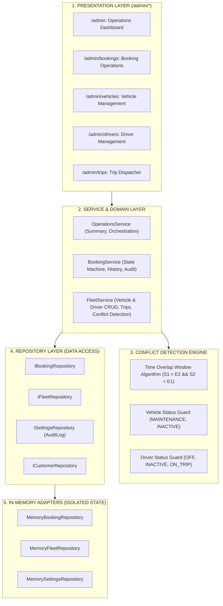
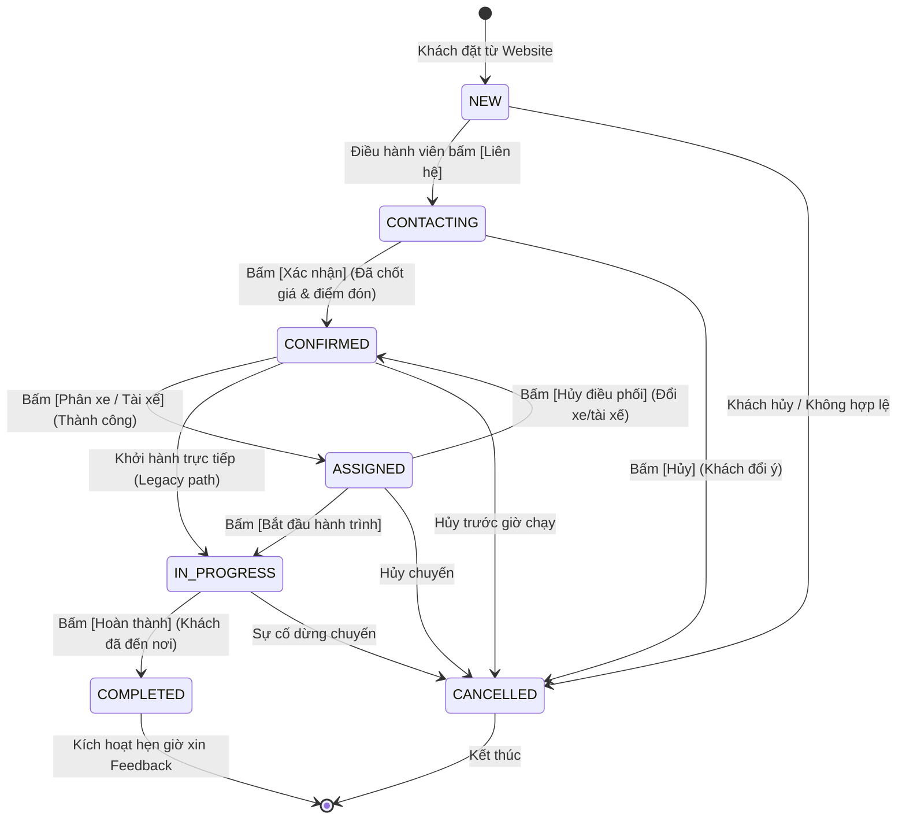
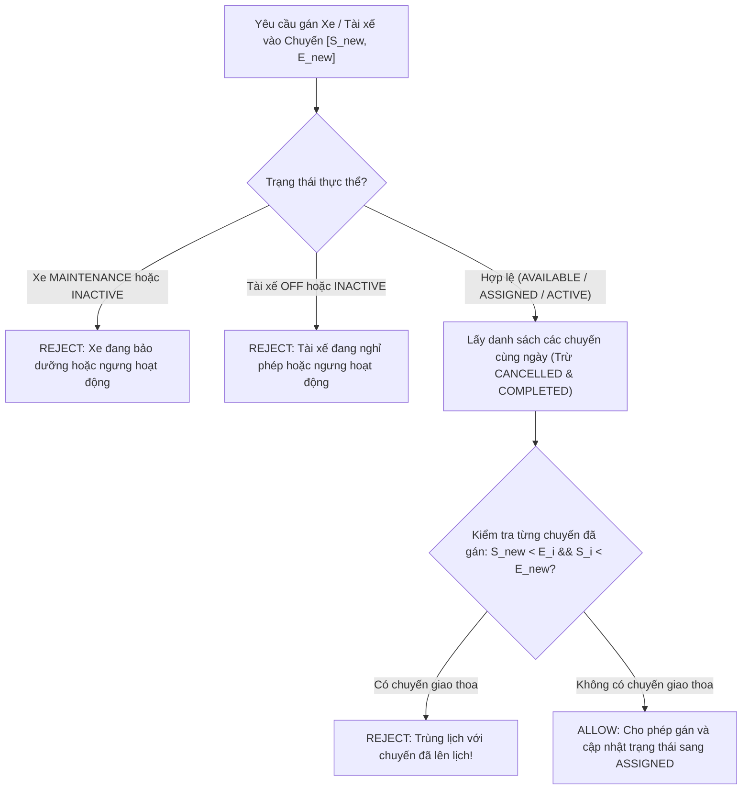

# KẾ HOẠCH KIẾN TRÚC PHASE 5: OPERATIONS & FLEET MANAGEMENT
**Hệ thống Điều Hành & Quản Lý Đội Xe Limousine Quảng Ninh - Ninh Bình**

- **Phiên bản:** 1.0.0
- **Trạng thái:** Thiết kế kiến trúc (Architecture Blueprint - Step 1 Audit & Plan)
- **Tác giả:** Senior Full-Stack Engineer + Software Architect + QA Engineer

---

## 1. TỔNG QUAN KIẾN TRÚC & PHẠM VI PHASE 5

Phase 5 tập trung xây dựng toàn bộ **Trung tâm Điều hành Vận hành (Operations & Fleet Center)** dành cho nhân viên điều hành xe, tài xế và quản lý tuyến. 

Hệ thống tuân thủ chặt chẽ:
- **Clean / Modular Architecture** (Presentation → Service Layer → Repository Interface → Memory Adapter)
- **Zero Breaking Changes** đối với Phase 1, Phase 2, Phase 3, Phase 4.
- **Repository Pattern & Single Source of Truth**: UI tuyệt đối không truy cập database hoặc mock data trực tiếp. Mọi thay đổi trạng thái, điều phối xe, phân tài xế đều đi qua Service Layer có kiểm tra logic nghiệp vụ và xung đột (Conflict Detection).



---

## 2. KẾT QUẢ AUDIT DỰ ÁN HIỆN TẠI (STEP 1 AUDIT)

### A. Những gì có thể tái sử dụng tối đa (Reusability):
1. **Domain Entities hiện có (`src/types/`):**
   - `Booking`, `Customer`, `Route`, `Vehicle`, `Driver`, `Trip`, `AuditLog`, `SystemSettings`.
   - `Booking` đã có sẵn các trường `vehicleId?: string;`, `driverId?: string;`, `tripId?: string;`, `statusHistory: BookingStatusHistoryItem[]`.
2. **Repository Interfaces & Singleton Pattern (`src/repositories/`):**
   - `IBookingRepository`: `findById`, `findByCode`, `update`, `list(filter: BookingFilter)`.
   - `IFleetRepository`: `listRoutes`, `listVehicles`, `getVehicleById`, `createVehicle`, `updateVehicle`, `listDrivers`, `getDriverById`, `createDriver`, `updateDriver`, `listTrips`, `getTripById`, `createTrip`, `updateTrip`.
   - `ISettingsRepository`: `createAuditLog(log: AuditLog)`, `listAuditLogs(entityType?, entityId?)`.
3. **Service Layer sẵn có (`src/services/`):**
   - `BookingService`: Quy trình chuyển đổi trạng thái một chiều, sinh mã, tự động tính mốc xin feedback.
   - `FeedbackService`: Phân loại đánh giá, xử lý tiêu cực.
4. **Design System & UI Components (`src/components/ui/`):**
   - Đầy đủ 16 nguyên tử giao diện: `Button`, `IconButton`, `Input`, `Select`, `Textarea`, `Badge`, `Card`, `Modal`, `Alert`, `Toast`, `Spinner`, `Skeleton`, `Divider`, `Container`.
   - Bảng màu nhận diện thương hiệu Hoàng gia: Navy (`#071A2B`), Gold (`#D4AF37`), Slate Canvas (`#F8FAFC`), White (`#FFFFFF`).
5. **Tiện ích Format & Validation:**
   - `formatCurrencyVN`, `formatDateVN`, `isValidVNPhone`, `normalizePhone`, `generateBookingCode`.

### B. Những gì cần bổ sung mới (Additions):
1. **Mở rộng Type-Safe cho Domain Models (`src/types/`):**
   - `BookingStatus`: Bổ sung `'ASSIGNED'` vào union type.
   - `VehicleStatus`: Bổ sung `'IN_SERVICE'` vào union type (`'AVAILABLE' | 'ASSIGNED' | 'IN_SERVICE' | 'MAINTENANCE' | 'INACTIVE'`).
   - `DriverStatus`: Mở rộng hỗ trợ `'AVAILABLE' | 'ACTIVE' | 'ASSIGNED' | 'ON_TRIP' | 'OFF' | 'OFF_DUTY' | 'INACTIVE'`.
   - `TripStatus`: Mở rộng hỗ trợ `'PLANNED' | 'ASSIGNED' | 'IN_PROGRESS' | 'CONFIRMED' | 'DEPARTED' | 'COMPLETED' | 'CANCELLED'`.
   - `Trip`: Thêm các trường hỗ trợ hiển thị điều hành: `route?: string; departureAt?: string; estimatedArrivalAt?: string;`.
2. **Repository Extensions (`IFleetRepository` & `MemoryFleetRepository`):**
   - Bổ sung `deleteVehicle(id: string): Promise<boolean>` (hoặc soft-delete).
   - Bổ sung `deleteDriver(id: string): Promise<boolean>`.
   - Bổ sung `deleteTrip(id: string): Promise<boolean>`.
3. **Service Layer:**
   - `src/services/fleetService.ts`: CRUD Vehicle, CRUD Driver, CRUD Trip, Conflict Detection (`detectVehicleConflict`, `detectDriverConflict`).
   - `src/services/operationsService.ts`: Thống kê tổng hợp điều hành (`getOperationsSummary`), Danh sách booking lọc/tìm kiếm, Điều phối gán/hủy xe (`assignVehicle`, `unassignVehicle`), Gán/hủy tài xế (`assignDriver`, `unassignDriver`), Tích hợp ghi nhận `AuditLog` và cập nhật `statusHistory`.
4. **Validation Schemas (`src/lib/validation/fleetSchema.ts`):**
   - Zod schema cho Vehicle (biển số xe chuẩn Việt Nam, số chỗ 5/7/11/16/29).
   - Zod schema cho Driver (họ tên, số điện thoại, số GPLX).
   - Zod schema cho Trip & Assignment (ngày giờ khởi hành, tuyến đường).
5. **Admin Presentation Layer (`src/app/admin/*`):**
   - `src/app/admin/layout.tsx`: Layout quản trị với Sidebar điều hướng, Header nội bộ, Responsive Drawer trên Mobile, không chứa Header/Footer marketing của public website.
   - `src/app/admin/page.tsx`: Dashboard tổng quan chỉ số vận hành thời gian thực.
   - `src/app/admin/bookings/page.tsx`: Danh sách & chi tiết Booking, bộ lọc đa năng, các nút thao tác tương thích State Machine.
   - `src/app/admin/vehicles/page.tsx`: Quản lý danh mục xe, cập nhật trạng thái hoạt động/bảo trì.
   - `src/app/admin/drivers/page.tsx`: Quản lý danh sách tài xế, ca trực, liên lạc.
   - `src/app/admin/trips/page.tsx`: Điều phối chuyến xe, phân xe/tài xế với cảnh báo xung đột tức thì.
6. **Automated Test Suite:**
   - `src/lib/test-phase5.ts` và npm script `"test:phase5": "tsx src/lib/test-phase5.ts"`.

### C. Những gì cần refactor (Refactoring):
1. **State Machine (`VALID_TRANSITIONS` trong `src/services/bookingService.ts`):**
   - Cập nhật thêm trạng thái `ASSIGNED` vào ma trận chuyển đổi sao cho:
     - `CONFIRMED → ASSIGNED → IN_PROGRESS → COMPLETED` (luồng chuẩn Phase 5).
     - Giữ `CONFIRMED → IN_PROGRESS` để 100% không làm gãy `test:phase1`.
     - `ASSIGNED → CONFIRMED` (cho phép hủy điều phối quay về đã xác nhận).
     - `ASSIGNED → CANCELLED` (cho phép hủy chuyến khi đã điều phối).
2. **Khởi tạo Mock Data cho Trips (`src/repositories/memory/mockData.ts`):**
   - Bổ sung một số trips mẫu để phục vụ kiểm thử và hiển thị ngay trên UI Admin Trips.

### D. Nguy cơ breaking change và biện pháp phòng ngừa (Risk Mitigation):
| Nguy cơ (Risk) | Khả năng ảnh hưởng | Biện pháp xử lý phòng ngừa (Mitigation) |
| :--- | :--- | :--- |
| **Sửa đổi BookingStatus làm hỏng test cũ** | Cao (`test:phase1`, `test:phase4`) | Giữ nguyên các trạng thái cũ (`NEW`, `CONTACTING`, `CONFIRMED`, `DEPOSIT_PAID`, `PAID`, `IN_PROGRESS`, `COMPLETED`, `CANCELLED`) và chỉ thêm `ASSIGNED`. Duy trì mọi bước chuyển trạng thái đã pass trong Phase 1. |
| **Xung đột Layout giữa Public Web và Admin** | Trung bình (Vỡ giao diện hoặc lặp Header/Footer) | `src/app/layout.tsx` chỉ chứa `{children}`. Trang `/admin` sẽ có `src/app/admin/layout.tsx` độc lập hoàn toàn, không đụng tới Header/Footer công khai. |
| **Tài xế/Xe bị trùng lặp lịch chạy** | Cao (Nghiệp vụ vận hành thực tế) | Xây dựng thuật toán kiểm tra giao thoa thời gian ở Service Layer: `detectVehicleConflict`, `detectDriverConflict` và bắt buộc gọi trước khi lưu. |
| **Treo Dev Server hoặc lỗi Port 3000** | Thấp | Không chạy lệnh tạo thêm dev server; chỉ dùng tiến trình hiện hữu và kiểm tra qua API/DOM tĩnh. |

### E. Kiểm tra trường dữ liệu Domain (Domain Fields Gap Check):
- `Booking`: Đã có `vehicleId`, `driverId`, `tripId`. Đủ trường cho nghiệp vụ điều phối.
- `Vehicle`: Cần đảm bảo có đủ 5 trạng thái (`AVAILABLE`, `ASSIGNED`, `IN_SERVICE`, `MAINTENANCE`, `INACTIVE`).
- `Driver`: Cần đảm bảo có đủ 5 trạng thái (`AVAILABLE`, `ASSIGNED`, `ON_TRIP`, `OFF`, `INACTIVE`).
- `Trip`: Cần đủ thời gian khởi hành, thời gian đến dự kiến, xe, tài xế, danh sách booking.

---

## 3. CẤU TRÚC MODULE CHI TIẾT (MODULE STRUCTURE)

```text
src/
├── types/
│   ├── fleet.ts                     # [MODIFY] Thêm VehicleStatus, DriverStatus, TripStatus
│   └── booking.ts                   # [MODIFY] Thêm 'ASSIGNED' vào BookingStatus
│
├── lib/
│   ├── validation/
│   │   └── fleetSchema.ts           # [NEW] Zod validation cho Vehicle, Driver, Trip, Assignment
│   └── test-phase5.ts               # [NEW] Bộ kiểm thử tự động toàn diện Phase 5
│
├── repositories/
│   ├── interfaces/
│   │   └── IFleetRepository.ts      # [MODIFY] Thêm phương thức delete & query mở rộng
│   └── memory/
│       ├── index.ts                 # [MODIFY] Cập nhật MemoryFleetRepository
│       └── mockData.ts              # [MODIFY] Bổ sung INITIAL_TRIPS mẫu
│
├── services/
│   ├── bookingService.ts            # [MODIFY] Cập nhật VALID_TRANSITIONS chứa ASSIGNED
│   ├── fleetService.ts              # [NEW] Vehicle/Driver/Trip CRUD & Conflict Detection
│   └── operationsService.ts         # [NEW] Quản lý điều hành, điều phối xe/tài xế, báo cáo số liệu
│
├── components/
│   └── admin/                       # [NEW] Các component điều hành nội bộ
│       ├── admin-sidebar.tsx        # Menu điều hướng quản trị (Desktop + Mobile Drawer)
│       ├── admin-header.tsx         # Thanh tiêu đề quản trị, breadcrumbs, user badge
│       ├── kpi-stat-card.tsx        # Thẻ hiển thị chỉ số nghiệp vụ vận hành
│       ├── booking-status-badge.tsx # Huy hiệu trạng thái booking tương ứng state machine
│       ├── vehicle-status-badge.tsx # Huy hiệu trạng thái phương tiện
│       ├── driver-status-badge.tsx  # Huy hiệu trạng thái tài xế
│       ├── trip-status-badge.tsx    # Huy hiệu trạng thái chuyến
│       ├── assign-vehicle-modal.tsx # Modal phân xe kèm cảnh báo conflict
│       ├── assign-driver-modal.tsx  # Modal phân tài xế kèm cảnh báo conflict
│       └── booking-detail-drawer.tsx# Drawer xem chi tiết booking & thực hiện actions
│
└── app/
    └── admin/                       # [NEW] App Router Admin Pages
        ├── layout.tsx               # Admin Shell Layout (Sidebar, Header, Content)
        ├── page.tsx                 # Operations Dashboard (/admin)
        ├── bookings/
        │   └── page.tsx             # Booking Operations (/admin/bookings)
        ├── vehicles/
        │   └── page.tsx             # Fleet Inventory (/admin/vehicles)
        ├── drivers/
        │   └── page.tsx             # Drivers Management (/admin/drivers)
        └── trips/
            └── page.tsx             # Trips Dispatcher (/admin/trips)
```

---

## 4. LUỒNG DỮ LIỆU & KIẾN TRÚC PHÂN TẦNG (DATA & SERVICE FLOW)

### 4.1. Quy trình Chuyển đổi Trạng thái Booking (State Machine Flow):



- **Ràng buộc bất biến:**
  - Không cho phép: `COMPLETED → NEW`, `COMPLETED → CONFIRMED`, `COMPLETED → IN_PROGRESS`, `CANCELLED → NEW`, `CANCELLED → CONFIRMED`.
  - Mọi bước chuyển đổi:
    1. Kiểm tra tính hợp lệ qua `VALID_TRANSITIONS`.
    2. Cập nhật `bookingStatus`.
    3. Thêm phần tử mới vào mảng `statusHistory` (`status`, `changedAt`, `changedBy`, `note`).
    4. Ghi một bản ghi `AuditLog` vào `ISettingsRepository`.

---

### 4.2. Thuật toán Phát hiện Xung đột Lịch chạy (Conflict Detection Algorithm):

Hệ thống bắt buộc ngăn chặn **Double Booking** cho cả Xe và Tài xế.

#### Công thức toán học:
Cho chuyến đi mới cần phân công với khoảng thời gian $[S_{\text{new}}, E_{\text{new}}]$ vào ngày $D_{\text{travel}}$, và chuyến đi đã tồn tại $i$ với khoảng thời gian $[S_i, E_i]$:
Hai chuyến xe xung đột thời gian khi và chỉ khi:
$$\max(S_{\text{new}}, S_i) < \min(E_{\text{new}}, E_i)$$
tương đương với:
$$S_{\text{new}} < E_i \quad \text{VÀ} \quad S_i < E_{\text{new}}$$



#### Ví dụ kiểm thử thực tế:
- **Trường hợp 1 (Xung đột):**
  - Chuyến A: 05:00 → 10:00.
  - Chuyến B: 06:00 → 09:00.
  - Cùng Xe hoặc cùng Tài xế $\rightarrow$ **REJECT** (Báo lỗi cụ thể mã chuyến và khoảng giờ trùng).
- **Trường hợp 2 (Tiếp nối hợp lệ):**
  - Chuyến A: 05:00 → 10:00.
  - Chuyến B: 10:01 → 14:00.
  - $S_B (10:01) \ge E_A (10:00) \rightarrow$ **ALLOW**.
- **Trường hợp 3 (Xe đang bảo trì):**
  - Xe `veh-04` có trạng thái `MAINTENANCE` $\rightarrow$ **REJECT** ngay từ đầu.
- **Trường hợp 4 (Tài xế đang nghỉ ca):**
  - Tài xế `drv-03` có trạng thái `OFF` $\rightarrow$ **REJECT** ngay từ đầu.

---

### 4.3. Luồng Điều Phối Nghiệp Vụ (Operations Flow):

1. **Xem và Lọc Đơn (`/admin/bookings`):**
   - Đọc qua `operationsService.listBookings({ status, serviceType, date, search })`.
   - Hiển thị danh sách phản hồi nhanh, huy hiệu màu trực quan.
2. **Xem Chi Tiết Đơn (Booking Detail Drawer):**
   - Đọc thông tin khách hàng, số điện thoại, điểm đón tận nơi, ghi chú, lịch sử trạng thái (`statusHistory`), xe và tài xế đã gán (nếu có).
3. **Thao Tác Chuyển Trạng Thái:**
   - Hệ thống chỉ bật sáng các nút thao tác hợp lệ dựa trên trạng thái hiện thời của đơn theo đúng `VALID_TRANSITIONS`.
4. **Phân Xe & Tài Xế:**
   - Khi chọn xe: Gọi `fleetService.detectVehicleConflict(vehicleId, date, startTime, endTime)`.
   - Khi chọn tài xế: Gọi `fleetService.detectDriverConflict(driverId, date, startTime, endTime)`.
   - Nếu có lỗi: Ném lỗi `ConflictError` kèm thông tin chuyến bị trùng, hiển thị Alert đỏ trên Modal.
   - Nếu thành công: Cập nhật booking (`vehicleId`, `driverId`, chuyển trạng thái `ASSIGNED`), cập nhật trạng thái Xe (`ASSIGNED`), cập nhật trạng thái Tài xế (`ASSIGNED`), ghi `statusHistory` và `AuditLog`.

---

## 5. THIẾT KẾ GIAO DIỆN OPERATIONS CENTER (/admin)

### 5.1. Bảng màu và Thẩm mỹ Chuẩn Design System:
- **Background**: Slate Canvas `#F8FAFC`, Sidebar & Header Navy `#071A2B`.
- **Accents**: Gold `#D4AF37` cho các thành phần hoạt động (active nav, primary actions, highlights).
- **Cards**: Bo góc 12px (`rounded-xl`), viền sáng `border-slate-200`, nền trắng `#FFFFFF`, đổ bóng nhẹ `shadow-card`.
- **Badges**:
  - `NEW`: Xanh lam dương (`bg-blue-50 text-blue-700 border-blue-200`)
  - `CONTACTING`: Vàng hổ phách (`bg-amber-50 text-amber-700 border-amber-200`)
  - `CONFIRMED`: Xanh ngọc lục bảo (`bg-emerald-50 text-emerald-700 border-emerald-200`)
  - `ASSIGNED`: Tím thương gia (`bg-purple-50 text-purple-700 border-purple-200`)
  - `IN_PROGRESS`: Cam đậm chuyển động (`bg-orange-50 text-orange-700 border-orange-200`)
  - `COMPLETED`: Xanh lá đậm bền vững (`bg-green-50 text-green-700 border-green-200`)
  - `CANCELLED`: Đỏ xám gạch ngang (`bg-rose-50 text-rose-700 border-rose-200`)

### 5.2. Trang Dashboard Tổng Quan (`/admin`):
- Thẻ chỉ số KPI dạng Grid (1 cột Mobile, 2 cột Tablet, 4 cột Desktop):
  - Tổng đơn hôm nay.
  - Số đơn cần xử lý ngay (`NEW` + `CONTACTING`).
  - Số đơn đã xác nhận / đã phân xe (`CONFIRMED` + `ASSIGNED`).
  - Số đơn đang chạy / hoàn thành (`IN_PROGRESS` + `COMPLETED`).
- Tình trạng Đội xe:
  - Sẵn sàng (`AVAILABLE`), Đang chạy (`IN_SERVICE` / `ASSIGNED`), Bảo trì (`MAINTENANCE`).
- Tình trạng Tài xế:
  - Sẵn sàng (`AVAILABLE`), Đang trên chuyến (`ON_TRIP` / `ASSIGNED`), Nghỉ ca (`OFF`).

### 5.3. Trang Quản Lý Booking (`/admin/bookings`):
- Thanh tìm kiếm tức thì theo: Mã booking, SĐT khách, Tên khách, Điểm đón/trả.
- Thanh bộ lọc nhanh (Pill selector): Tất cả, Mới, Đang liên hệ, Đã xác nhận, Đã phân xe, Đang chạy, Hoàn thành, Đã hủy.
- Bộ lọc ngày đón & loại dịch vụ.
- Bảng Desktop tối ưu hóa thông tin, Thẻ Mobile Card chống tràn ngang.
- Bấm vào hàng mở Drawer chi tiết bên phải (hoặc Modal trên Mobile).

### 5.4. Trang Quản Lý Xe (`/admin/vehicles`):
- Danh sách tất cả các xe trong hệ thống (5 - 7 - 11 - 16 - 29 chỗ).
- Hiển thị biển số, dòng xe, số ghế, tình trạng hoạt động, ghi chú kỹ thuật.
- Nút thêm xe mới và chuyển nhanh trạng thái (Bảo trì / Sẵn sàng).

### 5.5. Trang Quản Lý Tài Xế (`/admin/drivers`):
- Danh sách tài xế, ảnh đại diện/avatar chữ cái, số điện thoại, số GPLX, tình trạng trực ca.
- Thêm tài xế mới, sửa thông tin, chuyển đổi trạng thái (Nghỉ phép / Sẵn sàng).

### 5.6. Trang Điều Phối Chuyến Xe (`/admin/trips`):
- Xem danh sách chuyến xe được lên kế hoạch theo ngày.
- Ghép các booking vào chuyến xe chung (Limousine tuyến).
- Gán xe và tài xế trực tiếp với kiểm tra phát hiện xung đột thời gian thực.

---

## 6. CHIẾN LƯỢC KIỂM THỬ TỰ ĐỘNG (TESTING STRATEGY)

Tạo file kiểm thử tự động `src/lib/test-phase5.ts` và tích hợp vào script `npm run test:phase5`.

### 16 Kịch bản kiểm thử bắt buộc:
1. **Vehicle CRUD**: Tạo xe mới, lấy chi tiết, cập nhật thông tin, cập nhật trạng thái.
2. **Driver CRUD**: Tạo tài xế mới, lấy chi tiết, cập nhật thông tin, cập nhật trạng thái.
3. **Trip Creation**: Tạo chuyến xe với lộ trình, ngày giờ khởi hành và giờ đến dự kiến.
4. **Vehicle Assignment**: Phân xe thành công cho đơn booking và chuyển trạng thái sang `ASSIGNED`.
5. **Driver Assignment**: Phân tài xế thành công cho chuyến/đơn booking.
6. **Vehicle Conflict Detection (Double Booking)**: Chặn phân cùng một xe vào 2 chuyến trùng khung giờ (05:00-10:00 và 06:00-09:00) $\rightarrow$ Ném lỗi `ConflictError`.
7. **Driver Conflict Detection (Double Booking)**: Chặn phân cùng một tài xế vào 2 chuyến trùng khung giờ $\rightarrow$ Ném lỗi `ConflictError`.
8. **Valid Non-overlapping Assignment**: Cho phép phân xe/tài xế vào chuyến tiếp theo không trùng giờ (05:00-10:00 và 10:01-14:00) $\rightarrow$ Thành công.
9. **Vehicle Maintenance Guard**: Chặn phân xe đang có trạng thái `MAINTENANCE` $\rightarrow$ Ném lỗi nghiệp vụ.
10. **Driver Off-duty Guard**: Chặn phân tài xế đang có trạng thái `OFF` hoặc `INACTIVE` $\rightarrow$ Ném lỗi nghiệp vụ.
11. **State Machine Transition (Valid Flow)**: Chuyển tuần tự `NEW → CONTACTING → CONFIRMED → ASSIGNED → IN_PROGRESS → COMPLETED`.
12. **State Machine Transition (Invalid Rejection)**: Chặn chuyển lùi trái phép từ `COMPLETED → NEW` hoặc `CANCELLED → CONFIRMED`.
13. **AuditLog Integrity**: Kiểm tra mọi hành vi phân xe, phân tài xế, đổi trạng thái đều ghi nhận bản ghi `AuditLog` với đầy đủ `fromState`, `toState`, `entityId`, `userEmail`.
14. **statusHistory Append**: Đảm bảo mảng `statusHistory` tăng dần và lưu vết thời gian chính xác.
15. **Regression Phase 1**: Chạy `npm run test:phase1` đảm bảo 100% test cũ vẫn PASS.
16. **Regression Phase 4**: Chạy `npm run test:phase4` đảm bảo 100% flow đặt vé khách hàng vẫn PASS.

---

## 7. TIÊU CHUẨN ĐÁNH GIÁ VÀ NGHIỆM THU (QUALITY GATES)

- [ ] `npm run test:phase1` $\rightarrow$ PASS
- [ ] `npm run test:phase4` $\rightarrow$ PASS
- [ ] `npm run test:phase5` $\rightarrow$ PASS
- [ ] `npx tsc --noEmit` $\rightarrow$ PASS (0 type errors, 0 `any`)
- [ ] `npm run lint` $\rightarrow$ PASS (0 lint warnings/errors)
- [ ] `npm run build` $\rightarrow$ PASS
- [ ] Kiểm thử Responsive 11 kích thước màn hình: 320px, 360px, 375px, 390px, 414px, 768px, 1024px, 1280px, 1366px, 1440px, 1920px.
- [ ] Không có lỗi tràn màn hình ngang (`document.documentElement.scrollWidth === window.innerWidth`).
- [ ] Accessibility: Semantic HTML, aria-labels, touch target tối thiểu 44px.
- [ ] Báo cáo nghiệm thu `PHASE_5_REPORT.md` và cập nhật `CHANGELOG.md`.

---
*Tài liệu này hoàn tất Bước 1 (Audit & Architecture Plan). Không thực hiện code feature cho đến khi kế hoạch được phê duyệt.*
